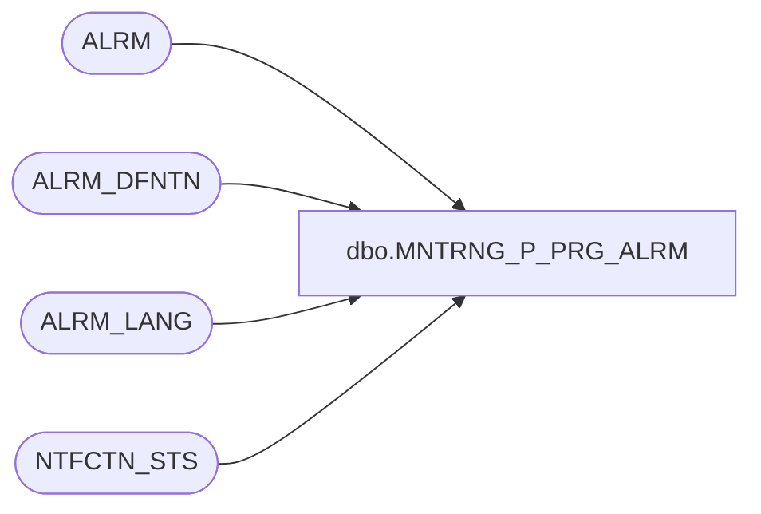

# dbo.MNTRNG_P_PRG_ALRM

**Database:** foundation_event  
**Server:** bedrockdb01  

## Architecture Diagram



## Table Dependencies

| Referenced Table |
|---|
| ALRM |
| ALRM_DFNTN |
| ALRM_LANG |
| NTFCTN_STS |

## Stored Procedure Code

```sql
/**************************************************************** 
 Name           : MNTRNG_P_PRG_ALRM 
 Purpose        : Purge ALRM, ALRM_LANG and NTFCTN_STS tables
 Parameters     : None
 Returns        : > 0 - successful (number of alarms deleted), -1 to -4 - unsuccessful 
 Created by     : Philippe Lanthier 
 Creation Date  : Dec-15-2004
****************************************************************/ 
CREATE PROCEDURE [dbo].[MNTRNG_P_PRG_ALRM] 

@BATCH_SIZE int --Number of deletes to do at a time

AS

--Create temporary event table to keep a copy of the batch
CREATE TABLE dbo.#TMP_ALRM
(
	ALRM_ID int NOT NULL
) 
ON [PRIMARY]


DECLARE @ROWS int,         --Number of alarms to be deleted
        @DELETED_ROWS int, --Number of records deleted
        @ERROR int         --Error code

-- Get the alarm for the current alarm definition
INSERT INTO #TMP_ALRM (ALRM_ID)
SELECT ALRM.ALRM_ID 
  FROM ALRM, ALRM_DFNTN
 WHERE ALRM.ALRM_DFNTN_ID = ALRM_DFNTN.ALRM_DFNTN_ID
   AND ALRM.ALRM_DTM < DATEADD(dd, -ALRM_DFNTN.NUM_DAYS_KEEP_ALRM, getdate())
   AND ALRM.ACKNWLDGMNT_USER_ID > 0
   
SELECT @ROWS = @@ROWCOUNT, @ERROR = @@ERROR
   
IF (@ERROR <> 0)
BEGIN
   DROP TABLE #TMP_ALRM
   SELECT @ERROR = -1   
	RETURN @ERROR
END
   
IF (@ROWS > 0)
BEGIN

   SET ROWCOUNT @BATCH_SIZE

   BEGIN TRAN

   --Alarm language
   SELECT @DELETED_ROWS = @BATCH_SIZE

   WHILE @DELETED_ROWS = @BATCH_SIZE
   BEGIN

      DELETE ALRM_LANG 
        FROM ALRM_LANG, #TMP_ALRM
       WHERE ALRM_LANG.ALRM_ID = #TMP_ALRM.ALRM_ID 
   
      SELECT @DELETED_ROWS = @@ROWCOUNT, @ERROR = @@ERROR

      IF (@ERROR <> 0)
      BEGIN
         ROLLBACK TRAN
         DROP TABLE #TMP_ALRM
         SET ROWCOUNT 0
         SELECT @ERROR = -2
      	RETURN @ERROR
      END
   END 

   --Notification status
   SELECT @DELETED_ROWS = @BATCH_SIZE

   WHILE @DELETED_ROWS = @BATCH_SIZE
   BEGIN

      DELETE NTFCTN_STS
        FROM NTFCTN_STS, #TMP_ALRM
       WHERE NTFCTN_STS.ALRM_ID = #TMP_ALRM.ALRM_ID 
   
      SELECT @DELETED_ROWS = @@ROWCOUNT, @ERROR = @@ERROR

      IF (@ERROR <> 0)
      BEGIN
         ROLLBACK TRAN
         DROP TABLE #TMP_ALRM
         SET ROWCOUNT 0
         SELECT @ERROR = -3
      	RETURN @ERROR
      END
   END 

   --Alarms
   SELECT @DELETED_ROWS = @BATCH_SIZE

   WHILE @DELETED_ROWS = @BATCH_SIZE
   BEGIN

      DELETE ALRM
        FROM ALRM, #TMP_ALRM
       WHERE ALRM.ALRM_ID = #TMP_ALRM.ALRM_ID 
   
      SELECT @DELETED_ROWS = @@ROWCOUNT, @ERROR = @@ERROR

      IF (@ERROR <> 0)
      BEGIN
         ROLLBACK TRAN
         DROP TABLE #TMP_ALRM
         SET ROWCOUNT 0
         SELECT @ERROR = -4
         RETURN @ERROR
      END
   END 

   COMMIT TRAN

   SET ROWCOUNT 0
END 

SELECT @DELETED_ROWS = COUNT(*) FROM #TMP_ALRM
SELECT @DELETED_ROWS = ISNULL(@DELETED_ROWS ,0)

DROP TABLE #TMP_ALRM

RETURN @DELETED_ROWS
```

