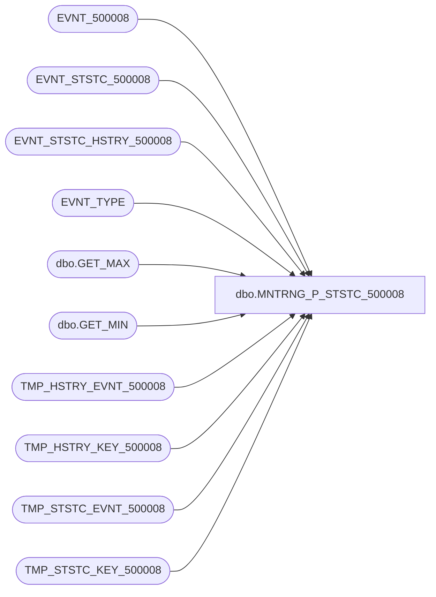

# dbo.MNTRNG_P_STSTC_500008

**Database:** foundation_event  
**Server:** bedrockdb01  

## Architecture Diagram



## Table Dependencies

| Referenced Table |
|---|
| EVNT_500008 |
| EVNT_STSTC_500008 |
| EVNT_STSTC_HSTRY_500008 |
| EVNT_TYPE |
| dbo.GET_MAX |
| dbo.GET_MIN |
| TMP_HSTRY_EVNT_500008 |
| TMP_HSTRY_KEY_500008 |
| TMP_STSTC_EVNT_500008 |
| TMP_STSTC_KEY_500008 |

## Stored Procedure Code

```sql
CREATE PROCEDURE [dbo].[MNTRNG_P_STSTC_500008]

@BATCH_SIZE as int --Max number of records in a batch
AS

--Create statistics temporary table to keep computed values per key
IF EXISTS (SELECT * FROM sysobjects WHERE xtype = 'U' AND name = 'TMP_STSTC_KEY_500008')
   DROP TABLE dbo.TMP_STSTC_KEY_500008

CREATE TABLE dbo.TMP_STSTC_KEY_500008
(
   POST_DTM smalldatetime NOT NULL
  , SRVR_NAME nvarchar(50) NOT NULL 
 , APP_ID decimal NOT NULL 
 , PRDCT_ID nvarchar(30) NOT NULL 
 , INSTNC_NUM smallint NOT NULL 
    , KEY_47 smallint NULL 
   , KEY_48 int NULL 
   , FLD_17_MIN bigint NULL 
   , FLD_17_MAX bigint NULL 

 , CNT integer NOT NULL
 , MIN_ID integer NOT NULL
 , MAX_ID integer NOT NULL
)

--Indexes to speed up process
CREATE CLUSTERED INDEX TMP_STSTC_KEY_500008_1 ON dbo.TMP_STSTC_KEY_500008 (POST_DTM , SRVR_NAME , APP_ID , PRDCT_ID , INSTNC_NUM , KEY_47 , KEY_48 ) ON [PRIMARY] 
CREATE INDEX TMP_STSTC_KEY_500008_2 ON dbo.TMP_STSTC_KEY_500008 (MIN_ID, MAX_ID) ON [PRIMARY]

--Create history temporary table to keep computed values per key
IF EXISTS (SELECT * FROM sysobjects WHERE xtype = 'U' AND name = 'TMP_HSTRY_KEY_500008')
   DROP TABLE dbo.TMP_HSTRY_KEY_500008

CREATE TABLE dbo.TMP_HSTRY_KEY_500008
(
   POST_YEAR smallint NOT NULL,
   POST_MNTH tinyint NOT NULL,
   POST_WEEK tinyint NOT NULL,
   POST_DAY tinyint NOT NULL,
   POST_DTM smalldatetime NOT NULL
  , SRVR_NAME nvarchar(50) NOT NULL 
 , APP_ID decimal NOT NULL 
 , PRDCT_ID nvarchar(30) NOT NULL 
 , INSTNC_NUM smallint NOT NULL 
    , KEY_47 smallint NULL 
   , KEY_48 int NULL 
   , FLD_17_MIN bigint NULL 
   , FLD_17_MAX bigint NULL 

 , CNT integer NOT NULL
 , MIN_ID integer NOT NULL
 , MAX_ID integer NOT NULL
)

--Indexes to speed up process 
CREATE CLUSTERED INDEX TMP_HSTRY_KEY_500008_1 ON dbo.TMP_HSTRY_KEY_500008 (SRVR_NAME , APP_ID , PRDCT_ID , INSTNC_NUM , KEY_47 , KEY_48 ) ON [PRIMARY] 
CREATE INDEX TMP_HSTRY_KEY_500008_2 ON dbo.TMP_HSTRY_KEY_500008 (MIN_ID, MAX_ID) ON [PRIMARY]

--Create temporary event table for statistics
IF EXISTS (SELECT * FROM sysobjects WHERE xtype = 'U' AND name = 'TMP_STSTC_EVNT_500008')
   DROP TABLE dbo.TMP_STSTC_EVNT_500008

CREATE TABLE dbo.TMP_STSTC_EVNT_500008
(
   ID_CLMN integer NOT NULL,
   POST_DTM smalldatetime NOT NULL
   , SRVR_NAME nvarchar(50) NOT NULL 
 , APP_ID decimal NOT NULL 
 , PRDCT_ID nvarchar(30) NOT NULL 
 , INSTNC_NUM smallint NOT NULL 
    , FLD_47 smallint NULL 
   , FLD_48 int NULL 
   , FLD_15 smallint NULL 
   , FLD_17 bigint NULL 
   , FLD_49 nvarchar(20) NULL 
   , FLD_50 int NULL 

) ON [PRIMARY]

--Indexes to speed up process
CREATE CLUSTERED INDEX TMP_STSTC_EVNT_500008_1 ON dbo.TMP_STSTC_EVNT_500008 (POST_DTM , SRVR_NAME , APP_ID , PRDCT_ID , INSTNC_NUM , FLD_47 , FLD_48 ) ON [PRIMARY] 
CREATE INDEX TMP_STSTC_EVNT_500008_2 ON dbo.TMP_STSTC_EVNT_500008 (ID_CLMN) ON [PRIMARY]

--Create temporary event table for history
IF EXISTS (SELECT * FROM sysobjects WHERE xtype = 'U' AND name = 'TMP_HSTRY_EVNT_500008')
   DROP TABLE dbo.TMP_HSTRY_EVNT_500008

CREATE TABLE dbo.TMP_HSTRY_EVNT_500008
(
   ID_CLMN integer NOT NULL,
   POST_YEAR smallint NOT NULL,
   POST_MNTH tinyint NOT NULL,
   POST_WEEK tinyint NOT NULL,
   POST_DAY tinyint NOT NULL,
   POST_DTM smalldatetime NOT NULL
   , SRVR_NAME nvarchar(50) NOT NULL 
 , APP_ID decimal NOT NULL 
 , PRDCT_ID nvarchar(30) NOT NULL 
 , INSTNC_NUM smallint NOT NULL 
    , FLD_47 smallint NULL 
   , FLD_48 int NULL 
   , FLD_15 smallint NULL 
   , FLD_17 bigint NULL 
   , FLD_49 nvarchar(20) NULL 
   , FLD_50 int NULL 

) ON [PRIMARY]

--Indexes to speed up process
CREATE CLUSTERED INDEX TMP_HSTRY_EVNT_500008_1 ON dbo.TMP_HSTRY_EVNT_500008 ( SRVR_NAME , APP_ID , PRDCT_ID , INSTNC_NUM , FLD_47 , FLD_48 ) ON [PRIMARY]
CREATE INDEX TMP_HSTRY_EVNT_500008_2 ON dbo.TMP_HSTRY_EVNT_500008 (ID_CLMN) ON [PRIMARY]

--Variables
DECLARE @MAX_EVNT_ID as int,        --Last event id processed during this cycle
        @STRT_EVNT_ID as int,       --First event of batch
        @END_EVNT_ID as int,        --Last event of batch
        @LAST_STSTC_EVNT_ID as int, --Last event id processed in the previous cycle
        @EVNT_TYPE_ID as int,       --Constant for Event Type ID
        @ERROR as int,              --Error return code
        @ROWS as int,               --Total number of events processed
        @ROWCOUNT as int,           --Number of events processed in a batch
        @STSTC_LVL as int           --Statistics level        

SELECT @EVNT_TYPE_ID = 500008, @ERROR = 0, @ROWS = 0, @END_EVNT_ID = 0

--Get last event id processed during this cycle
SELECT @MAX_EVNT_ID = MAX(ISNULL(EVNT_ID,0))
  FROM EVNT_500008

IF (@@ERROR <> 0)
   RETURN -1

--Get the stat level
SELECT @STSTC_LVL = STSTC_LVL
  FROM EVNT_TYPE
 WHERE EVNT_TYPE_ID = @EVNT_TYPE_ID

IF (@@ERROR <> 0)
   RETURN -2

--Loop to process all events by doing it in smaller batch
WHILE @END_EVNT_ID < @MAX_EVNT_ID
BEGIN

   --Get last event id processed in the previous cycle
   SELECT @LAST_STSTC_EVNT_ID = ISNULL(LAST_STSTC_EVNT_ID,0)
     FROM EVNT_TYPE
    WHERE EVNT_TYPE_ID = @EVNT_TYPE_ID

   IF (@@ERROR <> 0)
   BEGIN
      SELECT @ERROR = -3
      BREAK
   END

   --Set the batch range
   SELECT @STRT_EVNT_ID = @LAST_STSTC_EVNT_ID + 1, 
          @END_EVNT_ID = @LAST_STSTC_EVNT_ID + @BATCH_SIZE

   --Make sure to stay within the range of events to process
   IF @END_EVNT_ID > @MAX_EVNT_ID
      SELECT @END_EVNT_ID = @MAX_EVNT_ID

   IF @STRT_EVNT_ID > @END_EVNT_ID 
   BEGIN      
      SELECT @ERROR = @ROWS 
      BREAK
   END

   BEGIN TRAN

   --Populate the temporary event table for the statistics using only the new events
   INSERT INTO TMP_STSTC_EVNT_500008 (ID_CLMN, POST_DTM , SRVR_NAME , APP_ID , PRDCT_ID , INSTNC_NUM , FLD_47 , FLD_48 , FLD_15 , FLD_17 , FLD_49 , FLD_50 )
   SELECT EVNT_ID, DATEADD(ms, -DATEPART(ms, EVNT_POST_DTM), DATEADD(ss, -DATEPART(ss, EVNT_POST_DTM), DATEADD(mi, -DATEPART(mi, EVNT_POST_DTM), EVNT_POST_DTM))) 
          , SRVR_NAME , APP_ID , PRDCT_ID , INSTNC_NUM , FLD_47 , FLD_48 , FLD_15 , FLD_17 , FLD_49 , FLD_50 
    FROM EVNT_500008
   WHERE EVNT_ID BETWEEN @STRT_EVNT_ID AND @END_EVNT_ID

   --Get the number of rows processed
   SELECT @ROWCOUNT = @@ROWCOUNT, @ERROR = @@ERROR

   IF (@ERROR <> 0)
   BEGIN
      ROLLBACK TRAN
      SELECT @ERROR = -4
      BREAK
   END

   --Populate the temporary event table for the history using only the new events
   INSERT INTO TMP_HSTRY_EVNT_500008 (ID_CLMN, POST_YEAR, POST_MNTH, POST_WEEK, POST_DAY, POST_DTM , SRVR_NAME , APP_ID , PRDCT_ID , INSTNC_NUM , FLD_47 , FLD_48 , FLD_15 , FLD_17 , FLD_49 , FLD_50 )
   SELECT EVNT_ID,
          DATEPART(yy,EVNT_POST_DTM),
          DATEPART(mm,EVNT_POST_DTM),
          DATEPART(ww,EVNT_POST_DTM),
          DATEPART(dd,EVNT_POST_DTM),   
          DATEADD(ms, -DATEPART(ms, EVNT_POST_DTM), DATEADD(ss, -DATEPART(ss, EVNT_POST_DTM), DATEADD(mi, -DATEPART(mi, EVNT_POST_DTM), DATEADD(hh, -DATEPART(hh, EVNT_POST_DTM), EVNT_POST_DTM)))) 
          , SRVR_NAME , APP_ID , PRDCT_ID , INSTNC_NUM , FLD_47 , FLD_48 , FLD_15 , FLD_17 , FLD_49 , FLD_50 
    FROM EVNT_500008
   WHERE EVNT_ID BETWEEN @STRT_EVNT_ID AND @END_EVNT_ID

   --Get the number of rows processed (rowcount should be the same as the previous insert into tmp_ststc_evnt_x)
   SELECT @ROWCOUNT = @@ROWCOUNT, @ERROR = @@ERROR

   IF (@ERROR <> 0)
   BEGIN
      ROLLBACK TRAN
      SELECT @ERROR = -5
      BREAK
   END

   --Add the processed rows
   SELECT @ROWS = @ROWS + @ROWCOUNT

   --STATISTICS
   
   --Step 1-Insert computed values from the temp event table
   INSERT TMP_STSTC_KEY_500008 (POST_DTM , SRVR_NAME , APP_ID , PRDCT_ID , INSTNC_NUM , KEY_47 , KEY_48  , FLD_17_MIN , FLD_17_MAX , CNT, MIN_ID, MAX_ID)
   SELECT MIN(POST_DTM) , MIN(SRVR_NAME) , MIN(APP_ID) , MIN(PRDCT_ID) , MIN(INSTNC_NUM) , MIN(FLD_47) , MIN(FLD_48) , MIN(FLD_17) , MAX(FLD_17) , COUNT(*), MIN(ID_CLMN), MAX(ID_CLMN)
     FROM TMP_STSTC_EVNT_500008
    GROUP BY POST_DTM , SRVR_NAME , APP_ID , PRDCT_ID , INSTNC_NUM , FLD_47 , FLD_48 

   IF (@@ERROR <> 0)
   BEGIN
      ROLLBACK TRAN
      SELECT @ERROR = -6
      BREAK
   END

   --Step 2-Update actual statistics using the computed value temporary table
   UPDATE EVNT_STSTC_500008 SET 
          EVNT_STSTC_500008.CNT = s.CNT + te.CNT,
          EVNT_STSTC_500008.LAST_MDFD_DTM = getdate()
          , EVNT_STSTC_500008.FLD_15_LAST = L.FLD_15 
 , EVNT_STSTC_500008.FLD_17_MIN = dbo.GET_MIN(s.FLD_17_MIN, te.FLD_17_MIN) 
 , EVNT_STSTC_500008.FLD_17_MAX = dbo.GET_MAX(s.FLD_17_MAX, te.FLD_17_MAX) 
 
     FROM TMP_STSTC_KEY_500008 te, EVNT_STSTC_500008 s, TMP_STSTC_EVNT_500008 F, TMP_STSTC_EVNT_500008 L
    WHERE te.MIN_ID = F.ID_CLMN 
      AND te.MAX_ID = L.ID_CLMN
      AND s.POST_DTM = te.POST_DTM
           AND s.SRVR_NAME = te.SRVR_NAME 
  AND s.APP_ID = te.APP_ID 
  AND s.PRDCT_ID = te.PRDCT_ID 
  AND s.INSTNC_NUM = te.INSTNC_NUM 
  AND s.KEY_47 = te.KEY_47 
  AND s.KEY_48 = te.KEY_48 
    

   IF (@@ERROR <> 0)
   BEGIN
      ROLLBACK TRAN
      SELECT @ERROR = -7
      BREAK
   END

   --Step 3-clean the computed value temp table
   TRUNCATE TABLE TMP_STSTC_KEY_500008

   --Step 4-Delete temporary events already used to update statistics
   DELETE TMP_STSTC_EVNT_500008
     FROM TMP_STSTC_EVNT_500008 te, EVNT_STSTC_500008 s
    WHERE s.POST_DTM = te.POST_DTM
           AND s.SRVR_NAME = te.SRVR_NAME 
  AND s.APP_ID = te.APP_ID 
  AND s.PRDCT_ID = te.PRDCT_ID 
  AND s.INSTNC_NUM = te.INSTNC_NUM 
  AND s.KEY_47 = te.FLD_47 
  AND s.KEY_48 = te.FLD_48 
    

   IF (@@ERROR <> 0)
   BEGIN
      ROLLBACK TRAN
      SELECT @ERROR = -8
      BREAK
   END

   --Step 5-Insert computed values from the temp event table
   INSERT TMP_STSTC_KEY_500008 (POST_DTM , SRVR_NAME , APP_ID , PRDCT_ID , INSTNC_NUM , KEY_47 , KEY_48  , FLD_17_MIN , FLD_17_MAX , CNT, MIN_ID, MAX_ID)
   SELECT MIN(POST_DTM) , MIN(SRVR_NAME) , MIN(APP_ID) , MIN(PRDCT_ID) , MIN(INSTNC_NUM) , MIN(FLD_47) , MIN(FLD_48) , MIN(FLD_17) , MAX(FLD_17) , COUNT(*), MIN(ID_CLMN), MAX(ID_CLMN)
     FROM TMP_STSTC_EVNT_500008
    GROUP BY POST_DTM , SRVR_NAME , APP_ID , PRDCT_ID , INSTNC_NUM , FLD_47 , FLD_48 

   IF (@@ERROR <> 0)
   BEGIN
      ROLLBACK TRAN
      SELECT @ERROR = -9
      BREAK
   END

  --Step 6-Insert new keys using the computed value temporary table
  INSERT EVNT_STSTC_500008 (POST_DTM , SRVR_NAME , APP_ID , PRDCT_ID , INSTNC_NUM , KEY_47 , KEY_48 , CNT , FLD_15_LAST 
 , FLD_17_MIN , FLD_17_MAX )
   SELECT D.POST_DTM , D.SRVR_NAME , D.APP_ID , D.PRDCT_ID , D.INSTNC_NUM , D.KEY_47 , D.KEY_48 , D.CNT , L.FLD_15 , D.FLD_17_MIN , D.FLD_17_MAX 
     FROM TMP_STSTC_EVNT_500008 F, TMP_STSTC_EVNT_500008 L, TMP_STSTC_KEY_500008 D
    WHERE D.MIN_ID = F.ID_CLMN 
      AND D.MAX_ID = L.ID_CLMN

   IF (@@ERROR <> 0)
   BEGIN
      ROLLBACK TRAN
      SELECT @ERROR = -10
      BREAK
   END

   --Step 7-Clean temp tables
   TRUNCATE TABLE TMP_STSTC_EVNT_500008
   TRUNCATE TABLE TMP_STSTC_KEY_500008

   -- HISTORY
   
   --Continuous bucket
   IF (@STSTC_LVL <> 0)
   BEGIN
   
      --Step 1-Insert computed values from the temp event table
      INSERT TMP_HSTRY_KEY_500008 (POST_YEAR, POST_MNTH, POST_WEEK, POST_DAY , SRVR_NAME , APP_ID , PRDCT_ID , INSTNC_NUM , KEY_47 , KEY_48  , FLD_17_MIN , FLD_17_MAX , POST_DTM, CNT, MIN_ID, MAX_ID)
      SELECT 0, 0, 0, 0 , MIN(SRVR_NAME) , MIN(APP_ID) , MIN(PRDCT_ID) , MIN(INSTNC_NUM) , MIN(FLD_47) , MIN(FLD_48) , MIN(FLD_17) , MAX(FLD_17) , '01/01/1900 12:01:00 AM', COUNT(*), MIN(ID_CLMN), MAX(ID_CLMN)
        FROM TMP_HSTRY_EVNT_500008
        GROUP BY  SRVR_NAME , APP_ID , PRDCT_ID , INSTNC_NUM , FLD_47 , FLD_48 

      IF (@@ERROR <> 0)
      BEGIN
         ROLLBACK TRAN
         SELECT @ERROR = -11
         BREAK
      END
      
      --Step 2-Update actual statistics using the computed value temporary table
      UPDATE EVNT_STSTC_HSTRY_500008 SET 
             EVNT_STSTC_HSTRY_500008.CNT = s.CNT + te.CNT,
             EVNT_STSTC_HSTRY_500008.LAST_MDFD_DTM = getdate()
             , EVNT_STSTC_HSTRY_500008.FLD_15_LAST = L.FLD_15 
 , EVNT_STSTC_HSTRY_500008.FLD_17_MIN = dbo.GET_MIN(s.FLD_17_MIN, te.FLD_17_MIN) 
 , EVNT_STSTC_HSTRY_500008.FLD_17_MAX = dbo.GET_MAX(s.FLD_17_MAX, te.FLD_17_MAX) 
 
        FROM TMP_HSTRY_KEY_500008 te, EVNT_STSTC_HSTRY_500008 s, TMP_HSTRY_EVNT_500008 F, TMP_HSTRY_EVNT_500008 L
       WHERE te.MIN_ID = F.ID_CLMN 
         AND te.MAX_ID = L.ID_CLMN
         AND s.POST_YEAR = 0
         AND s.POST_MNTH = 0
         AND s.POST_WEEK = 0
         AND s.POST_DAY  = 0 
              AND s.SRVR_NAME = te.SRVR_NAME 
  AND s.APP_ID = te.APP_ID 
  AND s.PRDCT_ID = te.PRDCT_ID 
  AND s.INSTNC_NUM = te.INSTNC_NUM 
  AND s.KEY_47 = te.KEY_47 
  AND s.KEY_48 = te.KEY_48 
    

      IF (@@ERROR <> 0)
      BEGIN
         ROLLBACK TRAN
         SELECT @ERROR = -12
         BREAK
      END

      --Step 3-clean the computed value temp table
      TRUNCATE TABLE TMP_HSTRY_KEY_500008

      --Step 4-Delete temporary events already used to update statistics
      DELETE TMP_HSTRY_EVNT_500008
        FROM TMP_HSTRY_EVNT_500008 te, EVNT_STSTC_HSTRY_500008 s
       WHERE s.POST_YEAR = 0
         AND s.POST_MNTH = 0
         AND s.POST_WEEK = 0
         AND s.POST_DAY  = 0 
              AND s.SRVR_NAME = te.SRVR_NAME 
  AND s.APP_ID = te.APP_ID 
  AND s.PRDCT_ID = te.PRDCT_ID 
  AND s.INSTNC_NUM = te.INSTNC_NUM 
  AND s.KEY_47 = te.FLD_47 
  AND s.KEY_48 = te.FLD_48 
    

      IF (@@ERROR <> 0)
      BEGIN
         ROLLBACK TRAN
         SELECT @ERROR = -13
         BREAK
      END

      --Step 5-Insert computed values from the temp event table
      INSERT TMP_HSTRY_KEY_500008 (POST_YEAR, POST_MNTH, POST_WEEK, POST_DAY , SRVR_NAME , APP_ID , PRDCT_ID , INSTNC_NUM , KEY_47 , KEY_48  , FLD_17_MIN , FLD_17_MAX , POST_DTM, CNT, MIN_ID, MAX_ID)
      SELECT 0, 0, 0, 0 , MIN(SRVR_NAME) , MIN(APP_ID) , MIN(PRDCT_ID) , MIN(INSTNC_NUM) , MIN(FLD_47) , MIN(FLD_48) , MIN(FLD_17) , MAX(FLD_17) , '01/01/1900 12:01:00 AM', COUNT(*), MIN(ID_CLMN), MAX(ID_CLMN)
        FROM TMP_HSTRY_EVNT_500008
        GROUP BY  SRVR_NAME , APP_ID , PRDCT_ID , INSTNC_NUM , FLD_47 , FLD_48 

      IF (@@ERROR <> 0)
      BEGIN
         ROLLBACK TRAN
         SELECT @ERROR = -14
         BREAK
      END

      --Step 6-Insert new keys using the computed value temporary table
      INSERT EVNT_STSTC_HSTRY_500008 (POST_DTM, POST_YEAR, POST_MNTH, POST_WEEK, POST_DAY , SRVR_NAME , APP_ID , PRDCT_ID , INSTNC_NUM , KEY_47 , KEY_48 , CNT , FLD_15_LAST 
 , FLD_17_MIN , FLD_17_MAX )
      SELECT D.POST_DTM, 0, 0, 0, 0 , D.SRVR_NAME , D.APP_ID , D.PRDCT_ID , D.INSTNC_NUM , D.KEY_47 , D.KEY_48 , D.CNT , L.FLD_15 , D.FLD_17_MIN , D.FLD_17_MAX 
        FROM TMP_HSTRY_EVNT_500008 F, TMP_HSTRY_EVNT_500008 L, TMP_HSTRY_KEY_500008 D
       WHERE D.MIN_ID = F.ID_CLMN 
         AND D.MAX_ID = L.ID_CLMN

      IF (@@ERROR <> 0)
      BEGIN
         ROLLBACK TRAN
         SELECT @ERROR = -15
         BREAK
      END

      --Step 7-Clean temp tables
      TRUNCATE TABLE TMP_HSTRY_EVNT_500008
      TRUNCATE TABLE TMP_HSTRY_KEY_500008
   END

   --Update the last event id processed
   UPDATE EVNT_TYPE
      SET LAST_STSTC_EVNT_ID = @END_EVNT_ID
    WHERE EVNT_TYPE_ID = @EVNT_TYPE_ID 

   IF (@@ERROR <> 0)
   BEGIN
      ROLLBACK TRAN
      SELECT @ERROR = -16
      BREAK
   END

   COMMIT TRAN

END --WHILE

DROP TABLE TMP_STSTC_EVNT_500008
DROP TABLE TMP_HSTRY_EVNT_500008
DROP TABLE TMP_STSTC_KEY_500008
DROP TABLE TMP_HSTRY_KEY_500008

IF @ERROR <> 0
   RETURN @ERROR
ELSE
   RETURN @ROWS
```

