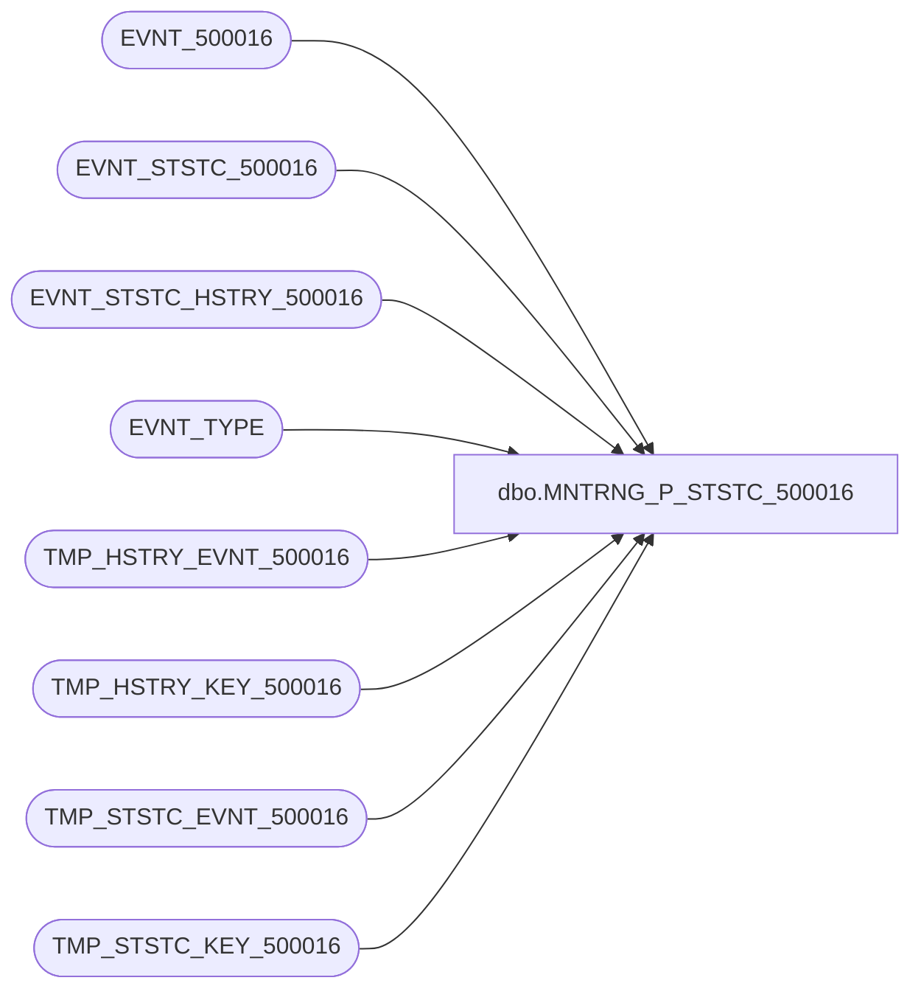

# dbo.MNTRNG_P_STSTC_500016

**Database:** foundation_event  
**Server:** bedrockdb01  

## Architecture Diagram



## Table Dependencies

| Referenced Table |
|---|
| EVNT_500016 |
| EVNT_STSTC_500016 |
| EVNT_STSTC_HSTRY_500016 |
| EVNT_TYPE |
| TMP_HSTRY_EVNT_500016 |
| TMP_HSTRY_KEY_500016 |
| TMP_STSTC_EVNT_500016 |
| TMP_STSTC_KEY_500016 |

## Stored Procedure Code

```sql
CREATE PROCEDURE [dbo].[MNTRNG_P_STSTC_500016]

@BATCH_SIZE as int --Max number of records in a batch
AS

--Create statistics temporary table to keep computed values per key
IF EXISTS (SELECT * FROM sysobjects WHERE xtype = 'U' AND name = 'TMP_STSTC_KEY_500016')
   DROP TABLE dbo.TMP_STSTC_KEY_500016

CREATE TABLE dbo.TMP_STSTC_KEY_500016
(
   POST_DTM smalldatetime NOT NULL
     , KEY_85 nvarchar(50) NULL 
   , KEY_1 smallint NULL 
   , KEY_2 smallint NULL 
   , KEY_90 nvarchar(255) NULL 

 , CNT integer NOT NULL
 , MIN_ID integer NOT NULL
 , MAX_ID integer NOT NULL
)

--Indexes to speed up process
CREATE CLUSTERED INDEX TMP_STSTC_KEY_500016_1 ON dbo.TMP_STSTC_KEY_500016 (POST_DTM , KEY_85 , KEY_1 , KEY_2 , KEY_90 ) ON [PRIMARY] 
CREATE INDEX TMP_STSTC_KEY_500016_2 ON dbo.TMP_STSTC_KEY_500016 (MIN_ID, MAX_ID) ON [PRIMARY]

--Create history temporary table to keep computed values per key
IF EXISTS (SELECT * FROM sysobjects WHERE xtype = 'U' AND name = 'TMP_HSTRY_KEY_500016')
   DROP TABLE dbo.TMP_HSTRY_KEY_500016

CREATE TABLE dbo.TMP_HSTRY_KEY_500016
(
   POST_YEAR smallint NOT NULL,
   POST_MNTH tinyint NOT NULL,
   POST_WEEK tinyint NOT NULL,
   POST_DAY tinyint NOT NULL,
   POST_DTM smalldatetime NOT NULL
     , KEY_85 nvarchar(50) NULL 
   , KEY_1 smallint NULL 
   , KEY_2 smallint NULL 
   , KEY_90 nvarchar(255) NULL 

 , CNT integer NOT NULL
 , MIN_ID integer NOT NULL
 , MAX_ID integer NOT NULL
)

--Indexes to speed up process 
CREATE CLUSTERED INDEX TMP_HSTRY_KEY_500016_1 ON dbo.TMP_HSTRY_KEY_500016 (KEY_85 , KEY_1 , KEY_2 , KEY_90 ) ON [PRIMARY] 
CREATE INDEX TMP_HSTRY_KEY_500016_2 ON dbo.TMP_HSTRY_KEY_500016 (MIN_ID, MAX_ID) ON [PRIMARY]

--Create temporary event table for statistics
IF EXISTS (SELECT * FROM sysobjects WHERE xtype = 'U' AND name = 'TMP_STSTC_EVNT_500016')
   DROP TABLE dbo.TMP_STSTC_EVNT_500016

CREATE TABLE dbo.TMP_STSTC_EVNT_500016
(
   ID_CLMN integer NOT NULL,
   POST_DTM smalldatetime NOT NULL
      , FLD_85 nvarchar(50) NULL 
   , FLD_84 int NULL 
   , FLD_86 smallint NULL 
   , FLD_1 smallint NULL 
   , FLD_2 smallint NULL 
   , FLD_467 smallint NULL 
   , FLD_90 nvarchar(255) NULL 
   , FLD_91 nvarchar(255) NULL 
   , FLD_92 int NULL 
   , FLD_93 int NULL 
   , FLD_94 nvarchar(50) NULL 
   , FLD_95 nvarchar(50) NULL 
   , FLD_70 datetime NULL 
   , FLD_71 datetime NULL 

) ON [PRIMARY]

--Indexes to speed up process
CREATE CLUSTERED INDEX TMP_STSTC_EVNT_500016_1 ON dbo.TMP_STSTC_EVNT_500016 (POST_DTM , FLD_85 , FLD_1 , FLD_2 , FLD_90 ) ON [PRIMARY] 
CREATE INDEX TMP_STSTC_EVNT_500016_2 ON dbo.TMP_STSTC_EVNT_500016 (ID_CLMN) ON [PRIMARY]

--Create temporary event table for history
IF EXISTS (SELECT * FROM sysobjects WHERE xtype = 'U' AND name = 'TMP_HSTRY_EVNT_500016')
   DROP TABLE dbo.TMP_HSTRY_EVNT_500016

CREATE TABLE dbo.TMP_HSTRY_EVNT_500016
(
   ID_CLMN integer NOT NULL,
   POST_YEAR smallint NOT NULL,
   POST_MNTH tinyint NOT NULL,
   POST_WEEK tinyint NOT NULL,
   POST_DAY tinyint NOT NULL,
   POST_DTM smalldatetime NOT NULL
      , FLD_85 nvarchar(50) NULL 
   , FLD_84 int NULL 
   , FLD_86 smallint NULL 
   , FLD_1 smallint NULL 
   , FLD_2 smallint NULL 
   , FLD_467 smallint NULL 
   , FLD_90 nvarchar(255) NULL 
   , FLD_91 nvarchar(255) NULL 
   , FLD_92 int NULL 
   , FLD_93 int NULL 
   , FLD_94 nvarchar(50) NULL 
   , FLD_95 nvarchar(50) NULL 
   , FLD_70 datetime NULL 
   , FLD_71 datetime NULL 

) ON [PRIMARY]

--Indexes to speed up process
CREATE CLUSTERED INDEX TMP_HSTRY_EVNT_500016_1 ON dbo.TMP_HSTRY_EVNT_500016 ( FLD_85 , FLD_1 , FLD_2 , FLD_90 ) ON [PRIMARY]
CREATE INDEX TMP_HSTRY_EVNT_500016_2 ON dbo.TMP_HSTRY_EVNT_500016 (ID_CLMN) ON [PRIMARY]

--Variables
DECLARE @MAX_EVNT_ID as int,        --Last event id processed during this cycle
        @STRT_EVNT_ID as int,       --First event of batch
        @END_EVNT_ID as int,        --Last event of batch
        @LAST_STSTC_EVNT_ID as int, --Last event id processed in the previous cycle
        @EVNT_TYPE_ID as int,       --Constant for Event Type ID
        @ERROR as int,              --Error return code
        @ROWS as int,               --Total number of events processed
        @ROWCOUNT as int,           --Number of events processed in a batch
        @STSTC_LVL as int           --Statistics level        

SELECT @EVNT_TYPE_ID = 500016, @ERROR = 0, @ROWS = 0, @END_EVNT_ID = 0

--Get last event id processed during this cycle
SELECT @MAX_EVNT_ID = MAX(ISNULL(EVNT_ID,0))
  FROM EVNT_500016

IF (@@ERROR <> 0)
   RETURN -1

--Get the stat level
SELECT @STSTC_LVL = STSTC_LVL
  FROM EVNT_TYPE
 WHERE EVNT_TYPE_ID = @EVNT_TYPE_ID

IF (@@ERROR <> 0)
   RETURN -2

--Loop to process all events by doing it in smaller batch
WHILE @END_EVNT_ID < @MAX_EVNT_ID
BEGIN

   --Get last event id processed in the previous cycle
   SELECT @LAST_STSTC_EVNT_ID = ISNULL(LAST_STSTC_EVNT_ID,0)
     FROM EVNT_TYPE
    WHERE EVNT_TYPE_ID = @EVNT_TYPE_ID

   IF (@@ERROR <> 0)
   BEGIN
      SELECT @ERROR = -3
      BREAK
   END

   --Set the batch range
   SELECT @STRT_EVNT_ID = @LAST_STSTC_EVNT_ID + 1, 
          @END_EVNT_ID = @LAST_STSTC_EVNT_ID + @BATCH_SIZE

   --Make sure to stay within the range of events to process
   IF @END_EVNT_ID > @MAX_EVNT_ID
      SELECT @END_EVNT_ID = @MAX_EVNT_ID

   IF @STRT_EVNT_ID > @END_EVNT_ID 
   BEGIN      
      SELECT @ERROR = @ROWS 
      BREAK
   END

   BEGIN TRAN

   --Populate the temporary event table for the statistics using only the new events
   INSERT INTO TMP_STSTC_EVNT_500016 (ID_CLMN, POST_DTM , FLD_85 , FLD_84 , FLD_86 , FLD_1 , FLD_2 , FLD_467 , FLD_90 , FLD_91 , FLD_92 , FLD_93 , FLD_94 , FLD_95 , FLD_70 , FLD_71 )
   SELECT EVNT_ID, DATEADD(ms, -DATEPART(ms, EVNT_POST_DTM), DATEADD(ss, -DATEPART(ss, EVNT_POST_DTM), DATEADD(mi, -DATEPART(mi, EVNT_POST_DTM), EVNT_POST_DTM))) 
          , FLD_85 , FLD_84 , FLD_86 , FLD_1 , FLD_2 , FLD_467 , FLD_90 , FLD_91 , FLD_92 , FLD_93 , FLD_94 , FLD_95 , FLD_70 , FLD_71 
    FROM EVNT_500016
   WHERE EVNT_ID BETWEEN @STRT_EVNT_ID AND @END_EVNT_ID

   --Get the number of rows processed
   SELECT @ROWCOUNT = @@ROWCOUNT, @ERROR = @@ERROR

   IF (@ERROR <> 0)
   BEGIN
      ROLLBACK TRAN
      SELECT @ERROR = -4
      BREAK
   END

   --Populate the temporary event table for the history using only the new events
   INSERT INTO TMP_HSTRY_EVNT_500016 (ID_CLMN, POST_YEAR, POST_MNTH, POST_WEEK, POST_DAY, POST_DTM , FLD_85 , FLD_84 , FLD_86 , FLD_1 , FLD_2 , FLD_467 , FLD_90 , FLD_91 , FLD_92 , FLD_93 , FLD_94 , FLD_95 , FLD_70 , FLD_71 )
   SELECT EVNT_ID,
          DATEPART(yy,EVNT_POST_DTM),
          DATEPART(mm,EVNT_POST_DTM),
          DATEPART(ww,EVNT_POST_DTM),
          DATEPART(dd,EVNT_POST_DTM),   
          DATEADD(ms, -DATEPART(ms, EVNT_POST_DTM), DATEADD(ss, -DATEPART(ss, EVNT_POST_DTM), DATEADD(mi, -DATEPART(mi, EVNT_POST_DTM), DATEADD(hh, -DATEPART(hh, EVNT_POST_DTM), EVNT_POST_DTM)))) 
          , FLD_85 , FLD_84 , FLD_86 , FLD_1 , FLD_2 , FLD_467 , FLD_90 , FLD_91 , FLD_92 , FLD_93 , FLD_94 , FLD_95 , FLD_70 , FLD_71 
    FROM EVNT_500016
   WHERE EVNT_ID BETWEEN @STRT_EVNT_ID AND @END_EVNT_ID

   --Get the number of rows processed (rowcount should be the same as the previous insert into tmp_ststc_evnt_x)
   SELECT @ROWCOUNT = @@ROWCOUNT, @ERROR = @@ERROR

   IF (@ERROR <> 0)
   BEGIN
      ROLLBACK TRAN
      SELECT @ERROR = -5
      BREAK
   END

   --Add the processed rows
   SELECT @ROWS = @ROWS + @ROWCOUNT

   --STATISTICS
   
   --Step 1-Insert computed values from the temp event table
   INSERT TMP_STSTC_KEY_500016 (POST_DTM , KEY_85 , KEY_1 , KEY_2 , KEY_90  , CNT, MIN_ID, MAX_ID)
   SELECT MIN(POST_DTM) , MIN(FLD_85) , MIN(FLD_1) , MIN(FLD_2) , MIN(FLD_90) , COUNT(*), MIN(ID_CLMN), MAX(ID_CLMN)
     FROM TMP_STSTC_EVNT_500016
    GROUP BY POST_DTM , FLD_85 , FLD_1 , FLD_2 , FLD_90 

   IF (@@ERROR <> 0)
   BEGIN
      ROLLBACK TRAN
      SELECT @ERROR = -6
      BREAK
   END

   --Step 2-Update actual statistics using the computed value temporary table
   UPDATE EVNT_STSTC_500016 SET 
          EVNT_STSTC_500016.CNT = s.CNT + te.CNT,
          EVNT_STSTC_500016.LAST_MDFD_DTM = getdate()
          , EVNT_STSTC_500016.FLD_467_LAST = L.FLD_467 
 , EVNT_STSTC_500016.FLD_94_LAST = L.FLD_94 
 , EVNT_STSTC_500016.FLD_95_LAST = L.FLD_95 
 , EVNT_STSTC_500016.FLD_70_LAST = L.FLD_70 
 , EVNT_STSTC_500016.FLD_71_LAST = L.FLD_71 
 
     FROM TMP_STSTC_KEY_500016 te, EVNT_STSTC_500016 s, TMP_STSTC_EVNT_500016 F, TMP_STSTC_EVNT_500016 L
    WHERE te.MIN_ID = F.ID_CLMN 
      AND te.MAX_ID = L.ID_CLMN
      AND s.POST_DTM = te.POST_DTM
           AND s.KEY_85 = te.KEY_85 
  AND s.KEY_1 = te.KEY_1 
  AND s.KEY_2 = te.KEY_2 
  AND s.KEY_90 = te.KEY_90 
    

   IF (@@ERROR <> 0)
   BEGIN
      ROLLBACK TRAN
      SELECT @ERROR = -7
      BREAK
   END

   --Step 3-clean the computed value temp table
   TRUNCATE TABLE TMP_STSTC_KEY_500016

   --Step 4-Delete temporary events already used to update statistics
   DELETE TMP_STSTC_EVNT_500016
     FROM TMP_STSTC_EVNT_500016 te, EVNT_STSTC_500016 s
    WHERE s.POST_DTM = te.POST_DTM
           AND s.KEY_85 = te.FLD_85 
  AND s.KEY_1 = te.FLD_1 
  AND s.KEY_2 = te.FLD_2 
  AND s.KEY_90 = te.FLD_90 
    

   IF (@@ERROR <> 0)
   BEGIN
      ROLLBACK TRAN
      SELECT @ERROR = -8
      BREAK
   END

   --Step 5-Insert computed values from the temp event table
   INSERT TMP_STSTC_KEY_500016 (POST_DTM , KEY_85 , KEY_1 , KEY_2 , KEY_90  , CNT, MIN_ID, MAX_ID)
   SELECT MIN(POST_DTM) , MIN(FLD_85) , MIN(FLD_1) , MIN(FLD_2) , MIN(FLD_90) , COUNT(*), MIN(ID_CLMN), MAX(ID_CLMN)
     FROM TMP_STSTC_EVNT_500016
    GROUP BY POST_DTM , FLD_85 , FLD_1 , FLD_2 , FLD_90 

   IF (@@ERROR <> 0)
   BEGIN
      ROLLBACK TRAN
      SELECT @ERROR = -9
      BREAK
   END

  --Step 6-Insert new keys using the computed value temporary table
  INSERT EVNT_STSTC_500016 (POST_DTM , KEY_85 , KEY_1 , KEY_2 , KEY_90 , CNT , FLD_467_LAST 
 , FLD_94_FRST , FLD_94_LAST 
 , FLD_95_FRST , FLD_95_LAST 
 , FLD_70_FRST , FLD_70_LAST 
 , FLD_71_FRST , FLD_71_LAST 
 )
   SELECT D.POST_DTM , D.KEY_85 , D.KEY_1 , D.KEY_2 , D.KEY_90 , D.CNT , L.FLD_467 , F.FLD_94 , L.FLD_94 , F.FLD_95 , L.FLD_95 , F.FLD_70 , L.FLD_70 , F.FLD_71 , L.FLD_71 
     FROM TMP_STSTC_EVNT_500016 F, TMP_STSTC_EVNT_500016 L, TMP_STSTC_KEY_500016 D
    WHERE D.MIN_ID = F.ID_CLMN 
      AND D.MAX_ID = L.ID_CLMN

   IF (@@ERROR <> 0)
   BEGIN
      ROLLBACK TRAN
      SELECT @ERROR = -10
      BREAK
   END

   --Step 7-Clean temp tables
   TRUNCATE TABLE TMP_STSTC_EVNT_500016
   TRUNCATE TABLE TMP_STSTC_KEY_500016

   -- HISTORY
   
   --Continuous bucket
   IF (@STSTC_LVL <> 0)
   BEGIN
   
      --Step 1-Insert computed values from the temp event table
      INSERT TMP_HSTRY_KEY_500016 (POST_YEAR, POST_MNTH, POST_WEEK, POST_DAY , KEY_85 , KEY_1 , KEY_2 , KEY_90  , POST_DTM, CNT, MIN_ID, MAX_ID)
      SELECT 0, 0, 0, 0 , MIN(FLD_85) , MIN(FLD_1) , MIN(FLD_2) , MIN(FLD_90) , '01/01/1900 12:01:00 AM', COUNT(*), MIN(ID_CLMN), MAX(ID_CLMN)
        FROM TMP_HSTRY_EVNT_500016
        GROUP BY  FLD_85 , FLD_1 , FLD_2 , FLD_90 

      IF (@@ERROR <> 0)
      BEGIN
         ROLLBACK TRAN
         SELECT @ERROR = -11
         BREAK
      END
      
      --Step 2-Update actual statistics using the computed value temporary table
      UPDATE EVNT_STSTC_HSTRY_500016 SET 
             EVNT_STSTC_HSTRY_500016.CNT = s.CNT + te.CNT,
             EVNT_STSTC_HSTRY_500016.LAST_MDFD_DTM = getdate()
             , EVNT_STSTC_HSTRY_500016.FLD_467_LAST = L.FLD_467 
 , EVNT_STSTC_HSTRY_500016.FLD_94_LAST = L.FLD_94 
 , EVNT_STSTC_HSTRY_500016.FLD_95_LAST = L.FLD_95 
 , EVNT_STSTC_HSTRY_500016.FLD_70_LAST = L.FLD_70 
 , EVNT_STSTC_HSTRY_500016.FLD_71_LAST = L.FLD_71 
 
        FROM TMP_HSTRY_KEY_500016 te, EVNT_STSTC_HSTRY_500016 s, TMP_HSTRY_EVNT_500016 F, TMP_HSTRY_EVNT_500016 L
       WHERE te.MIN_ID = F.ID_CLMN 
         AND te.MAX_ID = L.ID_CLMN
         AND s.POST_YEAR = 0
         AND s.POST_MNTH = 0
         AND s.POST_WEEK = 0
         AND s.POST_DAY  = 0 
              AND s.KEY_85 = te.KEY_85 
  AND s.KEY_1 = te.KEY_1 
  AND s.KEY_2 = te.KEY_2 
  AND s.KEY_90 = te.KEY_90 
    

      IF (@@ERROR <> 0)
      BEGIN
         ROLLBACK TRAN
         SELECT @ERROR = -12
         BREAK
      END

      --Step 3-clean the computed value temp table
      TRUNCATE TABLE TMP_HSTRY_KEY_500016

      --Step 4-Delete temporary events already used to update statistics
      DELETE TMP_HSTRY_EVNT_500016
        FROM TMP_HSTRY_EVNT_500016 te, EVNT_STSTC_HSTRY_500016 s
       WHERE s.POST_YEAR = 0
         AND s.POST_MNTH = 0
         AND s.POST_WEEK = 0
         AND s.POST_DAY  = 0 
              AND s.KEY_85 = te.FLD_85 
  AND s.KEY_1 = te.FLD_1 
  AND s.KEY_2 = te.FLD_2 
  AND s.KEY_90 = te.FLD_90 
    

      IF (@@ERROR <> 0)
      BEGIN
         ROLLBACK TRAN
         SELECT @ERROR = -13
         BREAK
      END

      --Step 5-Insert computed values from the temp event table
      INSERT TMP_HSTRY_KEY_500016 (POST_YEAR, POST_MNTH, POST_WEEK, POST_DAY , KEY_85 , KEY_1 , KEY_2 , KEY_90  , POST_DTM, CNT, MIN_ID, MAX_ID)
      SELECT 0, 0, 0, 0 , MIN(FLD_85) , MIN(FLD_1) , MIN(FLD_2) , MIN(FLD_90) , '01/01/1900 12:01:00 AM', COUNT(*), MIN(ID_CLMN), MAX(ID_CLMN)
        FROM TMP_HSTRY_EVNT_500016
        GROUP BY  FLD_85 , FLD_1 , FLD_2 , FLD_90 

      IF (@@ERROR <> 0)
      BEGIN
         ROLLBACK TRAN
         SELECT @ERROR = -14
         BREAK
      END

      --Step 6-Insert new keys using the computed value temporary table
      INSERT EVNT_STSTC_HSTRY_500016 (POST_DTM, POST_YEAR, POST_MNTH, POST_WEEK, POST_DAY , KEY_85 , KEY_1 , KEY_2 , KEY_90 , CNT , FLD_467_LAST 
 , FLD_94_FRST , FLD_94_LAST 
 , FLD_95_FRST , FLD_95_LAST 
 , FLD_70_FRST , FLD_70_LAST 
 , FLD_71_FRST , FLD_71_LAST 
 )
      SELECT D.POST_DTM, 0, 0, 0, 0 , D.KEY_85 , D.KEY_1 , D.KEY_2 , D.KEY_90 , D.CNT , L.FLD_467 , F.FLD_94 , L.FLD_94 , F.FLD_95 , L.FLD_95 , F.FLD_70 , L.FLD_70 , F.FLD_71 , L.FLD_71 
        FROM TMP_HSTRY_EVNT_500016 F, TMP_HSTRY_EVNT_500016 L, TMP_HSTRY_KEY_500016 D
       WHERE D.MIN_ID = F.ID_CLMN 
         AND D.MAX_ID = L.ID_CLMN

      IF (@@ERROR <> 0)
      BEGIN
         ROLLBACK TRAN
         SELECT @ERROR = -15
         BREAK
      END

      --Step 7-Clean temp tables
      TRUNCATE TABLE TMP_HSTRY_EVNT_500016
      TRUNCATE TABLE TMP_HSTRY_KEY_500016
   END

   --Update the last event id processed
   UPDATE EVNT_TYPE
      SET LAST_STSTC_EVNT_ID = @END_EVNT_ID
    WHERE EVNT_TYPE_ID = @EVNT_TYPE_ID 

   IF (@@ERROR <> 0)
   BEGIN
      ROLLBACK TRAN
      SELECT @ERROR = -16
      BREAK
   END

   COMMIT TRAN

END --WHILE

DROP TABLE TMP_STSTC_EVNT_500016
DROP TABLE TMP_HSTRY_EVNT_500016
DROP TABLE TMP_STSTC_KEY_500016
DROP TABLE TMP_HSTRY_KEY_500016

IF @ERROR <> 0
   RETURN @ERROR
ELSE
   RETURN @ROWS
```

