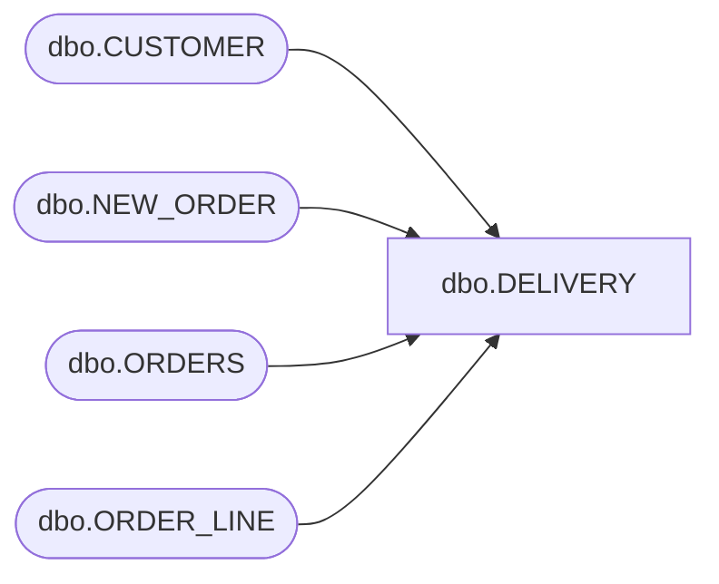

# dbo.DELIVERY

**Database:** tpcc  
**Server:** bedrockdb01  

## Architecture Diagram



## Table Dependencies

| Referenced Table |
|---|
| dbo.CUSTOMER |
| dbo.NEW_ORDER |
| dbo.ORDERS |
| dbo.ORDER_LINE |

## Stored Procedure Code

```sql
CREATE PROCEDURE [dbo].[DELIVERY]  
@d_w_id int,
@d_o_carrier_id int,
@timestamp datetime2(0)
AS 
BEGIN
SET ANSI_WARNINGS OFF
DECLARE
@d_no_o_id int, 
@d_d_id int, 
@d_c_id int, 
@d_ol_total int
BEGIN TRANSACTION
BEGIN TRY
DECLARE
@loop_counter int
SET @loop_counter = 1
WHILE @loop_counter <= 10
BEGIN
SET @d_d_id = @loop_counter


DECLARE @d_out TABLE (d_no_o_id INT)

DELETE TOP (1) 
FROM dbo.NEW_ORDER 
OUTPUT deleted.no_o_id INTO @d_out -- @d_no_o_id
WHERE NEW_ORDER.no_w_id = @d_w_id 
AND NEW_ORDER.no_d_id = @d_d_id 
AND NEW_ORDER.no_o_id =  @d_no_o_id

SELECT @d_no_o_id = d_no_o_id FROM @d_out
 

UPDATE dbo.ORDERS 
SET o_carrier_id = @d_o_carrier_id 
, @d_c_id = ORDERS.o_c_id 
WHERE ORDERS.o_id = @d_no_o_id 
AND ORDERS.o_d_id = @d_d_id 
AND ORDERS.o_w_id = @d_w_id


 SET @d_ol_total = 0

UPDATE dbo.ORDER_LINE 
SET ol_delivery_d = @timestamp
	, @d_ol_total = @d_ol_total + ol_amount
WHERE ORDER_LINE.ol_o_id = @d_no_o_id 
AND ORDER_LINE.ol_d_id = @d_d_id 
AND ORDER_LINE.ol_w_id = @d_w_id


UPDATE dbo.CUSTOMER SET c_balance = CUSTOMER.c_balance + @d_ol_total 
WHERE CUSTOMER.c_id = @d_c_id 
AND CUSTOMER.c_d_id = @d_d_id 
AND CUSTOMER.c_w_id = @d_w_id


PRINT 
'D: '
+ 
ISNULL(CAST(@d_d_id AS nvarchar(4000)), '')
+ 
'O: '
+ 
ISNULL(CAST(@d_no_o_id AS nvarchar(4000)), '')
+ 
'time '
+ 
ISNULL(CAST(@timestamp AS nvarchar(4000)), '')
SET @loop_counter = @loop_counter + 1
END
SELECT	@d_w_id as N'@d_w_id', @d_o_carrier_id as N'@d_o_carrier_id', @timestamp as N'@TIMESTAMP'
END TRY
BEGIN CATCH
SELECT 
ERROR_NUMBER() AS ErrorNumber
,ERROR_SEVERITY() AS ErrorSeverity
,ERROR_STATE() AS ErrorState
,ERROR_PROCEDURE() AS ErrorProcedure
,ERROR_LINE() AS ErrorLine
,ERROR_MESSAGE() AS ErrorMessage;
IF @@TRANCOUNT > 0
ROLLBACK TRANSACTION;
END CATCH;
IF @@TRANCOUNT > 0
COMMIT TRANSACTION;
END
```

