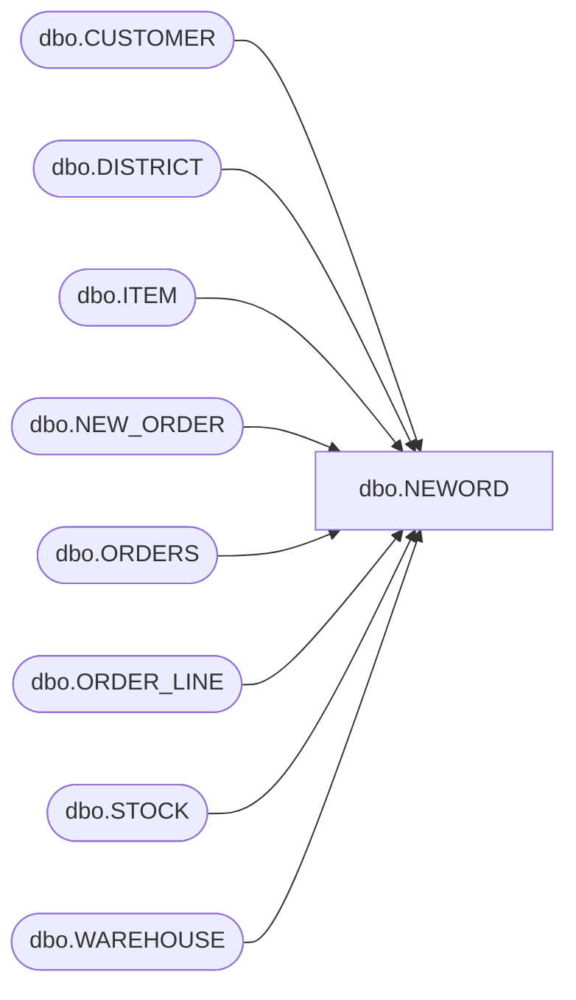

# dbo.NEWORD

**Database:** tpcc  
**Server:** bedrockdb01  

## Architecture Diagram



## Table Dependencies

| Referenced Table |
|---|
| dbo.CUSTOMER |
| dbo.DISTRICT |
| dbo.ITEM |
| dbo.NEW_ORDER |
| dbo.ORDERS |
| dbo.ORDER_LINE |
| dbo.STOCK |
| dbo.WAREHOUSE |

## Stored Procedure Code

```sql
CREATE PROCEDURE [dbo].[NEWORD]  
@no_w_id int,
@no_max_w_id int,
@no_d_id int,
@no_c_id int,
@no_o_ol_cnt int,
@TIMESTAMP datetime2(0)
AS 
BEGIN
SET ANSI_WARNINGS OFF
DECLARE
@no_c_discount smallmoney,
@no_c_last char(16),
@no_c_credit char(2),
@no_d_tax smallmoney,
@no_w_tax smallmoney,
@no_d_next_o_id int,
@no_ol_supply_w_id int, 
@no_ol_i_id int, 
@no_ol_quantity int, 
@no_o_all_local int, 
@o_id int, 
@no_i_name char(24), 
@no_i_price smallmoney, 
@no_i_data char(50), 
@no_s_quantity int, 
@no_ol_amount int, 
@no_s_dist_01 char(24), 
@no_s_dist_02 char(24), 
@no_s_dist_03 char(24), 
@no_s_dist_04 char(24), 
@no_s_dist_05 char(24), 
@no_s_dist_06 char(24), 
@no_s_dist_07 char(24), 
@no_s_dist_08 char(24), 
@no_s_dist_09 char(24), 
@no_s_dist_10 char(24), 
@no_ol_dist_info char(24), 
@no_s_data char(50), 
@x int, 
@rbk int
BEGIN TRANSACTION
BEGIN TRY

SET @no_o_all_local = 0
SELECT @no_c_discount = CUSTOMER.c_discount
, @no_c_last = CUSTOMER.c_last
, @no_c_credit = CUSTOMER.c_credit
, @no_w_tax = WAREHOUSE.w_tax 
FROM dbo.CUSTOMER, dbo.WAREHOUSE WITH (INDEX = W_Details)
WHERE WAREHOUSE.w_id = @no_w_id 
AND CUSTOMER.c_w_id = @no_w_id 
AND CUSTOMER.c_d_id = @no_d_id 
AND CUSTOMER.c_id = @no_c_id

UPDATE dbo.DISTRICT 
SET @no_d_tax = d_tax
, @o_id = d_next_o_id
,  d_next_o_id = DISTRICT.d_next_o_id + 1 
WHERE DISTRICT.d_id = @no_d_id 
AND DISTRICT.d_w_id = @no_w_id

INSERT dbo.ORDERS( o_id, o_d_id, o_w_id, o_c_id, o_entry_d, o_ol_cnt, o_all_local) 
VALUES ( @o_id, @no_d_id, @no_w_id, @no_c_id, @TIMESTAMP, @no_o_ol_cnt, @no_o_all_local)

INSERT dbo.NEW_ORDER(no_o_id, no_d_id, no_w_id) 
VALUES (@o_id, @no_d_id, @no_w_id)

SET @rbk = CAST(100 * RAND() + 1 AS INT)
DECLARE
@loop_counter int
SET @loop_counter = 1
DECLARE
@loop$bound int
SET @loop$bound = @no_o_ol_cnt
WHILE @loop_counter <= @loop$bound
BEGIN
IF ((@loop_counter = @no_o_ol_cnt) AND (@rbk = 1))
SET @no_ol_i_id = 100001
ELSE 
SET @no_ol_i_id =  CAST(1000000 * RAND() + 1 AS INT)
SET @x = CAST(100 * RAND() + 1 AS INT)
IF (@x > 1)
SET @no_ol_supply_w_id = @no_w_id
ELSE 
BEGIN
SET @no_ol_supply_w_id = @no_w_id
SET @no_o_all_local = 0
WHILE ((@no_ol_supply_w_id = @no_w_id) AND (@no_max_w_id != 1))
BEGIN
SET @no_ol_supply_w_id = CAST(@no_max_w_id * RAND() + 1 AS INT)
DECLARE
@db_null_statement$2 int
END
END
SET @no_ol_quantity = CAST(10 * RAND() + 1 AS INT)

SELECT @no_i_price = ITEM.i_price
, @no_i_name = ITEM.i_name
, @no_i_data = ITEM.i_data 
FROM dbo.ITEM 
WHERE ITEM.i_id = @no_ol_i_id

SELECT @no_s_quantity = STOCK.s_quantity
, @no_s_data = STOCK.s_data
, @no_s_dist_01 = STOCK.s_dist_01
, @no_s_dist_02 = STOCK.s_dist_02
, @no_s_dist_03 = STOCK.s_dist_03
, @no_s_dist_04 = STOCK.s_dist_04
, @no_s_dist_05 = STOCK.s_dist_05
, @no_s_dist_06 = STOCK.s_dist_06
, @no_s_dist_07 = STOCK.s_dist_07
, @no_s_dist_08 = STOCK.s_dist_08
, @no_s_dist_09 = STOCK.s_dist_09
, @no_s_dist_10 = STOCK.s_dist_10 
FROM dbo.STOCK
WHERE STOCK.s_i_id = @no_ol_i_id 
AND STOCK.s_w_id = @no_ol_supply_w_id


IF (@no_s_quantity > @no_ol_quantity)
SET @no_s_quantity = (@no_s_quantity - @no_ol_quantity)
ELSE 
SET @no_s_quantity = (@no_s_quantity - @no_ol_quantity + 91)

UPDATE dbo.STOCK
SET s_quantity = @no_s_quantity 
WHERE STOCK.s_i_id = @no_ol_i_id 
AND STOCK.s_w_id = @no_ol_supply_w_id

SET @no_ol_amount = (@no_ol_quantity * @no_i_price * (1 + @no_w_tax + @no_d_tax) * (1 - @no_c_discount))
IF @no_d_id = 1
SET @no_ol_dist_info = @no_s_dist_01
ELSE 
IF @no_d_id = 2
SET @no_ol_dist_info = @no_s_dist_02
ELSE 
IF @no_d_id = 3
SET @no_ol_dist_info = @no_s_dist_03
ELSE 
IF @no_d_id = 4
SET @no_ol_dist_info = @no_s_dist_04
ELSE 
IF @no_d_id = 5
SET @no_ol_dist_info = @no_s_dist_05
ELSE 
IF @no_d_id = 6
SET @no_ol_dist_info = @no_s_dist_06
ELSE 
IF @no_d_id = 7
SET @no_ol_dist_info = @no_s_dist_07
ELSE 
IF @no_d_id = 8
SET @no_ol_dist_info = @no_s_dist_08
ELSE 
IF @no_d_id = 9
SET @no_ol_dist_info = @no_s_dist_09
ELSE 
BEGIN
IF @no_d_id = 10
SET @no_ol_dist_info = @no_s_dist_10
END
INSERT dbo.ORDER_LINE( ol_o_id, ol_d_id, ol_w_id, ol_number, ol_i_id, ol_supply_w_id, ol_quantity, ol_amount, ol_dist_info)
VALUES ( @o_id, @no_d_id, @no_w_id, @loop_counter, @no_ol_i_id, @no_ol_supply_w_id, @no_ol_quantity, @no_ol_amount, @no_ol_dist_info)
SET @loop_counter = @loop_counter + 1
END
SELECT convert(char(8), @no_c_discount) as N'@no_c_discount', @no_c_last as N'@no_c_last', @no_c_credit as N'@no_c_credit', convert(char(8),@no_d_tax) as N'@no_d_tax', convert(char(8),@no_w_tax) as N'@no_w_tax', @no_d_next_o_id as N'@no_d_next_o_id'

END TRY
BEGIN CATCH
SELECT 
ERROR_NUMBER() AS ErrorNumber
,ERROR_SEVERITY() AS ErrorSeverity
,ERROR_STATE() AS ErrorState
,ERROR_PROCEDURE() AS ErrorProcedure
,ERROR_LINE() AS ErrorLine
,ERROR_MESSAGE() AS ErrorMessage;
IF @@TRANCOUNT > 0
ROLLBACK TRANSACTION;
END CATCH;
IF @@TRANCOUNT > 0
COMMIT TRANSACTION;

END
```

