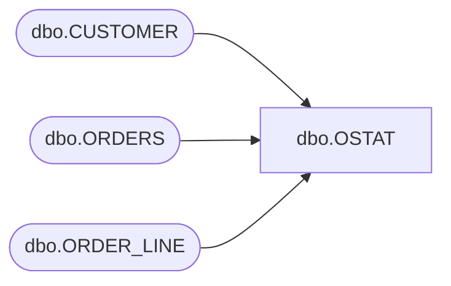

# dbo.OSTAT

**Database:** tpcc  
**Server:** bedrockdb01  

## Architecture Diagram



## Table Dependencies

| Referenced Table |
|---|
| dbo.CUSTOMER |
| dbo.ORDERS |
| dbo.ORDER_LINE |

## Stored Procedure Code

```sql
CREATE PROCEDURE [dbo].[OSTAT] 
@os_w_id int,
@os_d_id int,
@os_c_id int,
@byname int,
@os_c_last char(20)
AS 
BEGIN
SET ANSI_WARNINGS OFF
DECLARE
@os_c_first char(16),
@os_c_middle char(2),
@os_c_balance money,
@os_o_id int,
@os_entdate datetime2(0),
@os_o_carrier_id int,
@os_ol_i_id 	INT,
@os_ol_supply_w_id INT,
@os_ol_quantity INT,
@os_ol_amount 	INT,
@os_ol_delivery_d DATE,
@namecnt int, 
@i int,
@os_ol_i_id_array VARCHAR(200),
@os_ol_supply_w_id_array VARCHAR(200),
@os_ol_quantity_array VARCHAR(200),
@os_ol_amount_array VARCHAR(200),
@os_ol_delivery_d_array VARCHAR(210)
BEGIN TRANSACTION
BEGIN TRY
SET @os_ol_i_id_array = 'CSV,'
SET @os_ol_supply_w_id_array = 'CSV,'
SET @os_ol_quantity_array = 'CSV,'
SET @os_ol_amount_array = 'CSV,'
SET @os_ol_delivery_d_array = 'CSV,'
IF (@byname = 1)
BEGIN

SELECT @namecnt = count_big(CUSTOMER.c_id) 
FROM dbo.CUSTOMER 
WHERE CUSTOMER.c_last = @os_c_last AND CUSTOMER.c_d_id = @os_d_id AND CUSTOMER.c_w_id = @os_w_id

IF ((@namecnt % 2) = 1)
SET @namecnt = (@namecnt + 1)
DECLARE
c_name CURSOR LOCAL FOR 
SELECT CUSTOMER.c_balance
, CUSTOMER.c_first
, CUSTOMER.c_middle
, CUSTOMER.c_id 
FROM dbo.CUSTOMER 
WHERE CUSTOMER.c_last = @os_c_last 
AND CUSTOMER.c_d_id = @os_d_id 
AND CUSTOMER.c_w_id = @os_w_id 
ORDER BY CUSTOMER.c_first

OPEN c_name
BEGIN
DECLARE
@loop_counter int
SET @loop_counter = 0
DECLARE
@loop$bound int
SET @loop$bound = (@namecnt / 2)
WHILE @loop_counter <= @loop$bound
BEGIN
FETCH c_name
INTO @os_c_balance, @os_c_first, @os_c_middle, @os_c_id
SET @loop_counter = @loop_counter + 1
END
END
CLOSE c_name
DEALLOCATE c_name
END
ELSE 
BEGIN
SELECT @os_c_balance = CUSTOMER.c_balance, @os_c_first = CUSTOMER.c_first
, @os_c_middle = CUSTOMER.c_middle, @os_c_last = CUSTOMER.c_last 
FROM dbo.CUSTOMER WITH (repeatableread) 
WHERE CUSTOMER.c_id = @os_c_id AND CUSTOMER.c_d_id = @os_d_id AND CUSTOMER.c_w_id = @os_w_id
END
BEGIN
SELECT TOP (1) @os_o_id = fci.o_id, @os_o_carrier_id = fci.o_carrier_id, @os_entdate = fci.o_entry_d
FROM 
(SELECT TOP 9223372036854775807 ORDERS.o_id, ORDERS.o_carrier_id, ORDERS.o_entry_d 
FROM dbo.ORDERS WITH (serializable) 
WHERE ORDERS.o_d_id = @os_d_id 
AND ORDERS.o_w_id = @os_w_id 
AND ORDERS.o_c_id = @os_c_id 
ORDER BY ORDERS.o_id DESC)  AS fci
IF @@ROWCOUNT = 0
PRINT 'No ORDERS for CUSTOMER';
END
SET @i = 0
DECLARE
c_line CURSOR LOCAL FORWARD_ONLY FOR 
SELECT ORDER_LINE.ol_i_id
, ORDER_LINE.ol_supply_w_id
, ORDER_LINE.ol_quantity
, ORDER_LINE.ol_amount
, ORDER_LINE.ol_delivery_d 
FROM dbo.ORDER_LINE WITH (repeatableread) 
WHERE ORDER_LINE.ol_o_id = @os_o_id 
AND ORDER_LINE.ol_d_id = @os_d_id 
AND ORDER_LINE.ol_w_id = @os_w_id
OPEN c_line
WHILE 1 = 1
BEGIN
FETCH c_line
INTO 
@os_ol_i_id,
@os_ol_supply_w_id,
@os_ol_quantity,
@os_ol_amount,
@os_ol_delivery_d
IF @@FETCH_STATUS = -1
BREAK
set @os_ol_i_id_array += CAST(@i AS CHAR) + ',' + CAST(@os_ol_i_id AS CHAR)
set @os_ol_supply_w_id_array += CAST(@i AS CHAR) + ',' + CAST(@os_ol_supply_w_id AS CHAR)
set @os_ol_quantity_array += CAST(@i AS CHAR) + ',' + CAST(@os_ol_quantity AS CHAR)
set @os_ol_amount_array += CAST(@i AS CHAR) + ',' + CAST(@os_ol_amount AS CHAR);
set @os_ol_delivery_d_array += CAST(@i AS CHAR) + ',' + CAST(@os_ol_delivery_d AS CHAR)
SET @i = @i + 1
END
CLOSE c_line
DEALLOCATE c_line
SELECT	@os_c_id as N'@os_c_id', @os_c_last as N'@os_c_last', @os_c_first as N'@os_c_first', @os_c_middle as N'@os_c_middle', @os_c_balance as N'@os_c_balance', @os_o_id as N'@os_o_id', @os_entdate as N'@os_entdate', @os_o_carrier_id as N'@os_o_carrier_id'
END TRY
BEGIN CATCH
SELECT 
ERROR_NUMBER() AS ErrorNumber
,ERROR_SEVERITY() AS ErrorSeverity
,ERROR_STATE() AS ErrorState
,ERROR_PROCEDURE() AS ErrorProcedure
,ERROR_LINE() AS ErrorLine
,ERROR_MESSAGE() AS ErrorMessage;
IF @@TRANCOUNT > 0
ROLLBACK TRANSACTION;
END CATCH;
IF @@TRANCOUNT > 0
COMMIT TRANSACTION;
END
```

