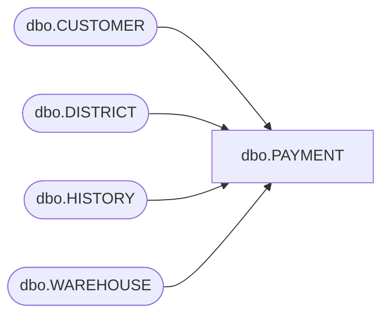

# dbo.PAYMENT

**Database:** tpcc  
**Server:** bedrockdb01  

## Architecture Diagram



## Table Dependencies

| Referenced Table |
|---|
| dbo.CUSTOMER |
| dbo.DISTRICT |
| dbo.HISTORY |
| dbo.WAREHOUSE |

## Stored Procedure Code

```sql
CREATE PROCEDURE [dbo].[PAYMENT]  
@p_w_id int,
@p_d_id int,
@p_c_w_id int,
@p_c_d_id int,
@p_c_id int,
@byname int,
@p_h_amount numeric(6,2),
@p_c_last char(16),
@TIMESTAMP datetime2(0)
AS 
BEGIN
SET ANSI_WARNINGS OFF
DECLARE
@p_w_street_1 char(20),
@p_w_street_2 char(20),
@p_w_city char(20),
@p_w_state char(2),
@p_w_zip char(10),
@p_d_street_1 char(20),
@p_d_street_2 char(20),
@p_d_city char(20),
@p_d_state char(20),
@p_d_zip char(10),
@p_c_first char(16),
@p_c_middle char(2),
@p_c_street_1 char(20),
@p_c_street_2 char(20),
@p_c_city char(20),
@p_c_state char(20),
@p_c_zip char(9),
@p_c_phone char(16),
@p_c_since datetime2(0),
@p_c_credit char(32),
@p_c_credit_lim  numeric(12,2), 
@p_c_discount  numeric(4,4),
@p_c_balance numeric(12,2),
@p_c_data varchar(500),
@namecnt int, 
@p_d_name char(11), 
@p_w_name char(11), 
@p_c_new_data varchar(500), 
@h_data varchar(30)
BEGIN TRANSACTION
BEGIN TRY

SELECT @p_w_street_1 = WAREHOUSE.w_street_1
, @p_w_street_2 = WAREHOUSE.w_street_2
, @p_w_city = WAREHOUSE.w_city
, @p_w_state = WAREHOUSE.w_state
, @p_w_zip = WAREHOUSE.w_zip
, @p_w_name = WAREHOUSE.w_name 
FROM dbo.WAREHOUSE WITH (INDEX = [W_Details])
WHERE WAREHOUSE.w_id = @p_w_id

UPDATE dbo.DISTRICT 
SET d_ytd = DISTRICT.d_ytd + @p_h_amount 
WHERE DISTRICT.d_w_id = @p_w_id 
AND DISTRICT.d_id = @p_d_id

SELECT @p_d_street_1 = DISTRICT.d_street_1
, @p_d_street_2 = DISTRICT.d_street_2
, @p_d_city = DISTRICT.d_city
, @p_d_state = DISTRICT.d_state
, @p_d_zip = DISTRICT.d_zip
, @p_d_name = DISTRICT.d_name 
FROM dbo.DISTRICT WITH (INDEX = D_Details)
WHERE DISTRICT.d_w_id = @p_w_id 
AND DISTRICT.d_id = @p_d_id
IF (@byname = 1)
BEGIN
SELECT @namecnt = count(CUSTOMER.c_id) 
FROM dbo.CUSTOMER WITH (repeatableread) 
WHERE CUSTOMER.c_last = @p_c_last 
AND CUSTOMER.c_d_id = @p_c_d_id 
AND CUSTOMER.c_w_id = @p_c_w_id

DECLARE
c_byname CURSOR STATIC LOCAL FOR 
SELECT CUSTOMER.c_first
, CUSTOMER.c_middle
, CUSTOMER.c_id
, CUSTOMER.c_street_1
, CUSTOMER.c_street_2
, CUSTOMER.c_city
, CUSTOMER.c_state
, CUSTOMER.c_zip
, CUSTOMER.c_phone
, CUSTOMER.c_credit
, CUSTOMER.c_credit_lim
, CUSTOMER.c_discount
, C_BAL.c_balance
, CUSTOMER.c_since 
FROM dbo.CUSTOMER  AS CUSTOMER WITH (INDEX = [CUSTOMER_I2], repeatableread)
INNER LOOP JOIN dbo.CUSTOMER AS C_BAL WITH (INDEX = [CUSTOMER_I1], repeatableread) 
ON C_BAL.c_w_id = CUSTOMER.c_w_id
  AND C_BAL.c_d_id = CUSTOMER.c_d_id
  AND C_BAL.c_id = CUSTOMER.c_id
WHERE CUSTOMER.c_w_id = @p_c_w_id 
  AND CUSTOMER.c_d_id = @p_c_d_id 
  AND CUSTOMER.c_last = @p_c_last 
ORDER BY CUSTOMER.c_first
OPTION ( MAXDOP 1)
OPEN c_byname
IF ((@namecnt % 2) = 1)
SET @namecnt = (@namecnt + 1)
BEGIN
DECLARE
@loop_counter int
SET @loop_counter = 0
DECLARE
@loop$bound int
SET @loop$bound = (@namecnt / 2)
WHILE @loop_counter <= @loop$bound
BEGIN
FETCH c_byname
INTO 
@p_c_first, 
@p_c_middle, 
@p_c_id, 
@p_c_street_1, 
@p_c_street_2, 
@p_c_city, 
@p_c_state, 
@p_c_zip, 
@p_c_phone, 
@p_c_credit, 
@p_c_credit_lim, 
@p_c_discount, 
@p_c_balance, 
@p_c_since
SET @loop_counter = @loop_counter + 1
END
END
CLOSE c_byname
DEALLOCATE c_byname
END
ELSE 
BEGIN
SELECT @p_c_first = CUSTOMER.c_first, @p_c_middle = CUSTOMER.c_middle, @p_c_last = CUSTOMER.c_last
, @p_c_street_1 = CUSTOMER.c_street_1, @p_c_street_2 = CUSTOMER.c_street_2
, @p_c_city = CUSTOMER.c_city, @p_c_state = CUSTOMER.c_state
, @p_c_zip = CUSTOMER.c_zip, @p_c_phone = CUSTOMER.c_phone
, @p_c_credit = CUSTOMER.c_credit, @p_c_credit_lim = CUSTOMER.c_credit_lim
, @p_c_discount = CUSTOMER.c_discount, @p_c_balance = CUSTOMER.c_balance
, @p_c_since = CUSTOMER.c_since 
FROM dbo.CUSTOMER 
WHERE CUSTOMER.c_w_id = @p_c_w_id 
AND CUSTOMER.c_d_id = @p_c_d_id 
AND CUSTOMER.c_id = @p_c_id 

END
SET @p_c_balance = (@p_c_balance + @p_h_amount)
IF @p_c_credit = 'BC'
BEGIN
SELECT @p_c_data = CUSTOMER.c_data FROM dbo.CUSTOMER WHERE CUSTOMER.c_w_id = @p_c_w_id 
AND CUSTOMER.c_d_id = @p_c_d_id AND CUSTOMER.c_id = @p_c_id
SET @h_data = (ISNULL(@p_w_name, '') + ' ' + ISNULL(@p_d_name, ''))
SET @p_c_new_data = (
ISNULL(CAST(@p_c_id AS char), '')
 + 
' '
 + 
ISNULL(CAST(@p_c_d_id AS char), '')
 + 
' '
 + 
ISNULL(CAST(@p_c_w_id AS char), '')
 + 
' '
 + 
ISNULL(CAST(@p_d_id AS char), '')
 + 
' '
 + 
ISNULL(CAST(@p_w_id AS char), '')
 + 
' '
 + 
ISNULL(CAST(@p_h_amount AS CHAR(8)), '')
 + 
ISNULL(CAST(@TIMESTAMP AS char), '')
 + 
ISNULL(@h_data, ''))
SET @p_c_new_data = substring((@p_c_new_data + @p_c_data), 1, 500 - LEN(@p_c_new_data))
UPDATE dbo.CUSTOMER SET c_balance = @p_c_balance, c_data = @p_c_new_data 
WHERE CUSTOMER.c_w_id = @p_c_w_id 
AND CUSTOMER.c_d_id = @p_c_d_id AND CUSTOMER.c_id = @p_c_id
END
ELSE 
UPDATE dbo.CUSTOMER SET c_balance = @p_c_balance 
WHERE CUSTOMER.c_w_id = @p_c_w_id 
AND CUSTOMER.c_d_id = @p_c_d_id 
AND CUSTOMER.c_id = @p_c_id

SET @h_data = (ISNULL(@p_w_name, '') + ' ' + ISNULL(@p_d_name, ''))

INSERT dbo.HISTORY( h_c_d_id, h_c_w_id, h_c_id, h_d_id, h_w_id, h_date, h_amount, h_data) 
VALUES ( @p_c_d_id, @p_c_w_id, @p_c_id, @p_d_id, @p_w_id, @TIMESTAMP, @p_h_amount, @h_data)
SELECT	@p_c_id as N'@p_c_id', @p_c_last as N'@p_c_last', @p_w_street_1 as N'@p_w_street_1'
, @p_w_street_2 as N'@p_w_street_2', @p_w_city as N'@p_w_city'
, @p_w_state as N'@p_w_state', @p_w_zip as N'@p_w_zip'
, @p_d_street_1 as N'@p_d_street_1', @p_d_street_2 as N'@p_d_street_2'
, @p_d_city as N'@p_d_city', @p_d_state as N'@p_d_state'
, @p_d_zip as N'@p_d_zip', @p_c_first as N'@p_c_first'
, @p_c_middle as N'@p_c_middle', @p_c_street_1 as N'@p_c_street_1'
, @p_c_street_2 as N'@p_c_street_2'
, @p_c_city as N'@p_c_city', @p_c_state as N'@p_c_state', @p_c_zip as N'@p_c_zip'
, @p_c_phone as N'@p_c_phone', @p_c_since as N'@p_c_since', @p_c_credit as N'@p_c_credit'
, @p_c_credit_lim as N'@p_c_credit_lim', @p_c_discount as N'@p_c_discount', @p_c_balance as N'@p_c_balance'
, @p_c_data as N'@p_c_data'


UPDATE dbo.WAREHOUSE WITH (XLOCK)
SET w_ytd = WAREHOUSE.w_ytd + @p_h_amount 
WHERE WAREHOUSE.w_id = @p_w_id

END TRY
BEGIN CATCH
SELECT 
ERROR_NUMBER() AS ErrorNumber
,ERROR_SEVERITY() AS ErrorSeverity
,ERROR_STATE() AS ErrorState
,ERROR_PROCEDURE() AS ErrorProcedure
,ERROR_LINE() AS ErrorLine
,ERROR_MESSAGE() AS ErrorMessage;
IF @@TRANCOUNT > 0
ROLLBACK TRANSACTION;
END CATCH;
IF @@TRANCOUNT > 0
COMMIT TRANSACTION;
END
```

