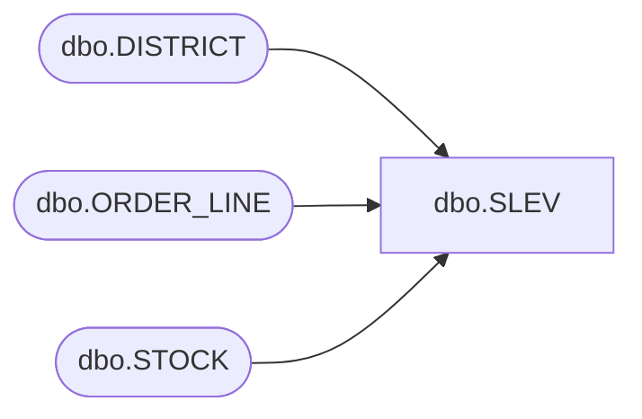

# dbo.SLEV

**Database:** tpcc  
**Server:** bedrockdb01  

## Architecture Diagram



## Table Dependencies

| Referenced Table |
|---|
| dbo.DISTRICT |
| dbo.ORDER_LINE |
| dbo.STOCK |

## Stored Procedure Code

```sql
CREATE PROCEDURE [dbo].[SLEV]  
@st_w_id int,
@st_d_id int,
@threshold int
AS 
BEGIN
DECLARE
@st_o_id int, 
@STOCK_count int 
BEGIN TRANSACTION
BEGIN TRY

SELECT @st_o_id = DISTRICT.d_next_o_id 
FROM dbo.DISTRICT 
WHERE DISTRICT.d_w_id = @st_w_id AND DISTRICT.d_id = @st_d_id

SELECT @STOCK_count = count_big(DISTINCT STOCK.s_i_id) 
FROM dbo.ORDER_LINE
, dbo.STOCK
WHERE ORDER_LINE.ol_w_id = @st_w_id 
AND ORDER_LINE.ol_d_id = @st_d_id 
AND (ORDER_LINE.ol_o_id < @st_o_id) 
AND ORDER_LINE.ol_o_id >= (@st_o_id - 20) 
AND STOCK.s_w_id = @st_w_id 
AND STOCK.s_i_id = ORDER_LINE.ol_i_id 
AND STOCK.s_quantity < @threshold
OPTION (LOOP JOIN, MAXDOP 1)

SELECT	@st_o_id as N'@st_o_id', @STOCK_count as N'@STOCK_count'
END TRY
BEGIN CATCH
SELECT 
ERROR_NUMBER() AS ErrorNumber
,ERROR_SEVERITY() AS ErrorSeverity
,ERROR_STATE() AS ErrorState
,ERROR_PROCEDURE() AS ErrorProcedure
,ERROR_LINE() AS ErrorLine
,ERROR_MESSAGE() AS ErrorMessage;
IF @@TRANCOUNT > 0
ROLLBACK TRANSACTION;
END CATCH;
IF @@TRANCOUNT > 0
COMMIT TRANSACTION;
END
```

