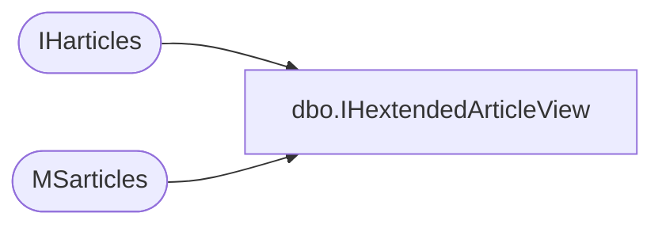

# dbo.IHextendedArticleView

**Database:** CRDM_Distributor  
**Server:** bedrockdb01  

## Architecture Diagram



## Table Dependencies

| Referenced Table |
|---|
| IHarticles |
| MSarticles |

## View Code

```sql
create view IHextendedArticleView as  SELECT msa.publisher_id,       msa.publication_id,       msa.article,       msa.destination_object,       msa.source_owner,       msa.source_object,       msa.description,       iha.creation_script,       iha.del_cmd,       iha.filter,       iha.filter_clause,       iha.ins_cmd,       iha.pre_creation_cmd,       iha.status,       iha.type,       iha.upd_cmd,       iha.schema_option,       iha.dest_owner  FROM   MSarticles msa  JOIN   IHarticles iha   ON  msa.article_id     = iha.article_id
```

