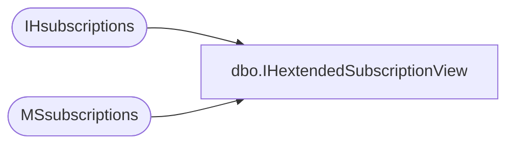

# dbo.IHextendedSubscriptionView

**Database:** CRDM_Distributor  
**Server:** bedrockdb01  

## Architecture Diagram



## Table Dependencies

| Referenced Table |
|---|
| IHsubscriptions |
| MSsubscriptions |

## View Code

```sql
create view IHextendedSubscriptionView as  SELECT  ihs.article_id,  ihs.dest_db,  ihs.srvid,  ihs.login_name,  ihs.distribution_jobid,  mss.publisher_database_id,  mss.subscription_type,  mss.sync_type,  mss.status,  mss.snapshot_seqno_flag,  mss.independent_agent,  mss.subscription_time,  mss.loopback_detection,  mss.agent_id,  mss.update_mode,  mss.publisher_seqno,  mss.ss_cplt_seqno   FROM IHsubscriptions ihs  JOIN MSsubscriptions mss ON ihs.article_id = mss.article_id                          and ihs.srvid = mss.subscriber_id                          and ihs.dest_db = mss.subscriber_db
```

