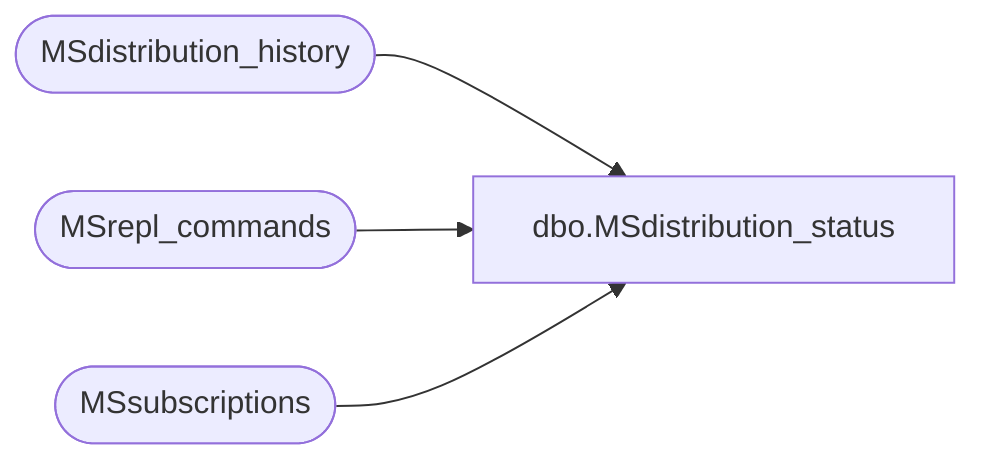

# dbo.MSdistribution_status

**Database:** CRDM_Distributor  
**Server:** bedrockdb01  

## Architecture Diagram



## Table Dependencies

| Referenced Table |
|---|
| MSdistribution_history |
| MSrepl_commands |
| MSsubscriptions |

## View Code

```sql
CREATE VIEW MSdistribution_status (article_id,agent_id,UndelivCmdsInDistDB,DelivCmdsInDistDB)
as
-- Note that this view does not account for (i.e. exclude from counts) commands that do not need to be delivered 
-- because of loopback or syncronous updating subscribers, nor subscriptions never activated.
-- It also may not be exact due to use of NOLOCK - so that it does not cause blocking or deadlock issues.
SELECT t.article_id,s.agent_id,
'UndelivCmdsInDistDB'=SUM(CASE WHEN xact_seqno > h.maxseq THEN 1 ELSE 0 END),
'DelivCmdsInDistDB'=SUM(CASE WHEN xact_seqno <=  h.maxseq THEN 1 ELSE 0 END)
FROM	(SELECT	article_id,publisher_database_id, xact_seqno
	FROM MSrepl_commands with (NOLOCK) ) as t
JOIN (SELECT agent_id,article_id,publisher_database_id FROM MSsubscriptions with (NOLOCK) ) AS s 
ON (t.article_id = s.article_id AND t.publisher_database_id=s.publisher_database_id )
JOIN (SELECT agent_id,'maxseq'= isnull(max(xact_seqno),0x0) FROM MSdistribution_history with (NOLOCK) GROUP BY agent_id) as h
ON (h.agent_id=s.agent_id)
GROUP BY t.article_id,s.agent_id
```

