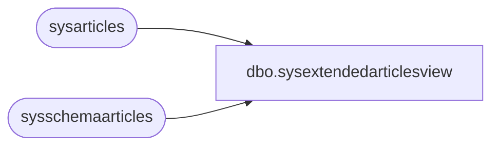

# dbo.sysextendedarticlesview

**Database:** CRDM_Distributor  
**Server:** bedrockdb01  

## Architecture Diagram



## Table Dependencies

| Referenced Table |
|---|
| sysarticles |
| sysschemaarticles |

## View Code

```sql
create view dbo.sysextendedarticlesview
               as
               select * from sysarticles
               union all
               select artid, creation_script, NULL, description,
               dest_object, NULL, NULL, NULL, name, objid, pubid, 
               pre_creation_cmd, status, NULL, type, NULL, 
               schema_option, dest_owner, NULL, NULL, NULL, NULL, 0 from sysschemaarticles
               go
```

