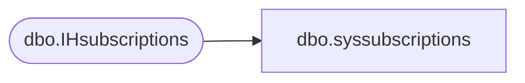

# dbo.syssubscriptions

**Database:** CRDM_Distributor  
**Server:** bedrockdb01  

## Architecture Diagram



## Table Dependencies

| Referenced Table |
|---|
| dbo.IHsubscriptions |

## View Code

```sql
CREATE VIEW dbo.syssubscriptions (artid, srvid, dest_db, status, sync_type, login_name, subscription_type,
            distribution_jobid, timestamp, update_mode, loopback_detection, queued_reinit, nosync_type, srvname)
            AS 
            SELECT ihsub.article_id, 
                 ihsub.srvid, 
                 ihsub.dest_db, 
                 ihsub.status, 
                 ihsub.sync_type, 
                 ihsub.login_name, 
                 ihsub.subscription_type, 
                 ihsub.distribution_jobid, 
                 ihsub.timestamp, 
                 ihsub.update_mode, 
                 ihsub.loopback_detection, 
                 ihsub.queued_reinit, 
                 ihsub.nosync_type, 
                 ihsub.srvname 
            FROM   dbo.IHsubscriptions ihsub
```

