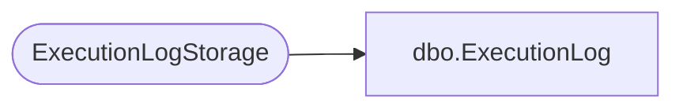

# dbo.ExecutionLog

**Database:** ReportServerSA  
**Server:** bedrockdb01  

## Architecture Diagram



## Table Dependencies

| Referenced Table |
|---|
| ExecutionLogStorage |

## View Code

```sql
CREATE VIEW [dbo].[ExecutionLog]
AS
SELECT
    [InstanceName], 
    [ReportID], 
    [UserName], 
    CASE ([RequestType])
        WHEN 1 THEN CONVERT(BIT, 1)
        ELSE CONVERT(BIT, 0)
    END AS [RequestType],
    [Format],
    [Parameters],
    [TimeStart],
    [TimeEnd],
    [TimeDataRetrieval],
    [TimeProcessing],
    [TimeRendering],
    CASE([Source])
        WHEN 6 THEN 3
        ELSE [Source]
    END AS Source,      -- Session source doesn't exist in yukon, mark source as snapshot
                        -- for in-session requests
    [Status],
    [ByteCount],
    [RowCount]
FROM [ExecutionLogStorage] WITH (NOLOCK)
WHERE [ReportAction] = 1 -- Backwards compatibility log only contains render requests
```

