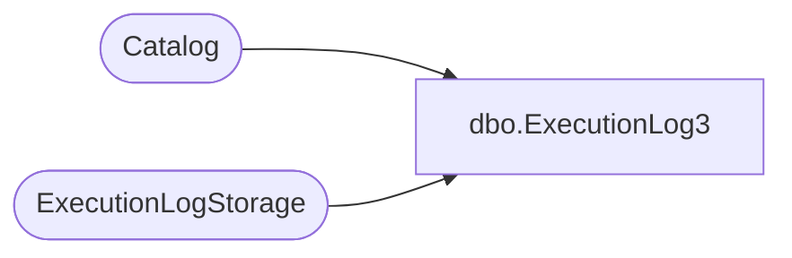

# dbo.ExecutionLog3

**Database:** ReportServerWebIM  
**Server:** bedrockdb01  

## Architecture Diagram



## Table Dependencies

| Referenced Table |
|---|
| Catalog |
| ExecutionLogStorage |

## View Code

```sql
CREATE VIEW [dbo].[ExecutionLog3]
AS
SELECT 
    InstanceName, 
    COALESCE(C.Path, 'Unknown') AS ItemPath, 
    UserName,
    ExecutionId, 
    CASE(RequestType)
        WHEN 0 THEN 'Interactive'
        WHEN 1 THEN 'Subscription'
        WHEN 2 THEN 'Refresh Cache'
        ELSE 'Unknown'
        END AS RequestType, 
    -- SubscriptionId, 
    Format, 
    Parameters, 
    CASE(ReportAction)		
        WHEN 1 THEN 'Render'
        WHEN 2 THEN 'BookmarkNavigation'
        WHEN 3 THEN 'DocumentMapNavigation'
        WHEN 4 THEN 'DrillThrough'
        WHEN 5 THEN 'FindString'
        WHEN 6 THEN 'GetDocumentMap'
        WHEN 7 THEN 'Toggle'
        WHEN 8 THEN 'Sort'
        WHEN 9 THEN 'Execute'
        WHEN 10 THEN 'RenderEdit'
        ELSE 'Unknown'
        END AS ItemAction,
    TimeStart, 
    TimeEnd, 
    TimeDataRetrieval, 
    TimeProcessing, 
    TimeRendering,
    CASE(Source)
        WHEN 1 THEN 'Live'
        WHEN 2 THEN 'Cache'
        WHEN 3 THEN 'Snapshot' 
        WHEN 4 THEN 'History'
        WHEN 5 THEN 'AdHoc'
        WHEN 6 THEN 'Session'
        WHEN 7 THEN 'Rdce'
        ELSE 'Unknown'
        END AS Source,
    Status,
    ByteCount,
    [RowCount],
    AdditionalInfo
FROM ExecutionLogStorage EL WITH(NOLOCK)
LEFT OUTER JOIN Catalog C WITH(NOLOCK) ON (EL.ReportID = C.ItemID)
```

