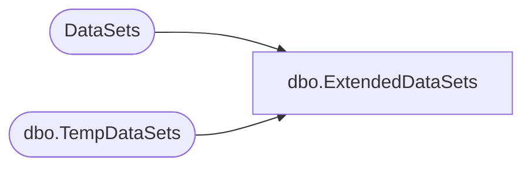

# dbo.ExtendedDataSets

**Database:** ReportServerWebIM  
**Server:** bedrockdb01  

## Architecture Diagram



## Table Dependencies

| Referenced Table |
|---|
| DataSets |
| dbo.TempDataSets |

## View Code

```sql
CREATE VIEW [dbo].ExtendedDataSets
AS 
SELECT 
	ID, LinkID, [Name], ItemID
FROM DataSets
UNION ALL
SELECT
	ID, LinkID, [Name], ItemID
FROM [ReportServerWebIMTempDB].dbo.TempDataSets
```

