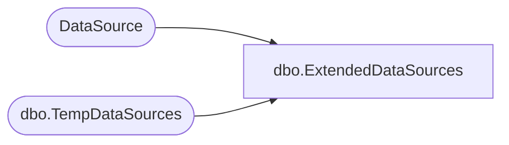

# dbo.ExtendedDataSources

**Database:** ReportServerWebIM  
**Server:** bedrockdb01  

## Architecture Diagram



## Table Dependencies

| Referenced Table |
|---|
| DataSource |
| dbo.TempDataSources |

## View Code

```sql
CREATE VIEW [dbo].ExtendedDataSources
AS 
SELECT 
	DSID, ItemID, SubscriptionID, Name, Extension, Link, 
	CredentialRetrieval, Prompt, ConnectionString, 
	OriginalConnectionString, OriginalConnectStringExpressionBased, 
	UserName, Password, Flags, Version
FROM DataSource
UNION ALL
SELECT
	DSID, ItemID, NULL as [SubscriptionID], Name, Extension, Link, 
	CredentialRetrieval, Prompt, ConnectionString, 
	OriginalConnectionString, OriginalConnectStringExpressionBased, 
	UserName, Password, Flags, Version
FROM [ReportServerWebIMTempDB].dbo.TempDataSources
```

