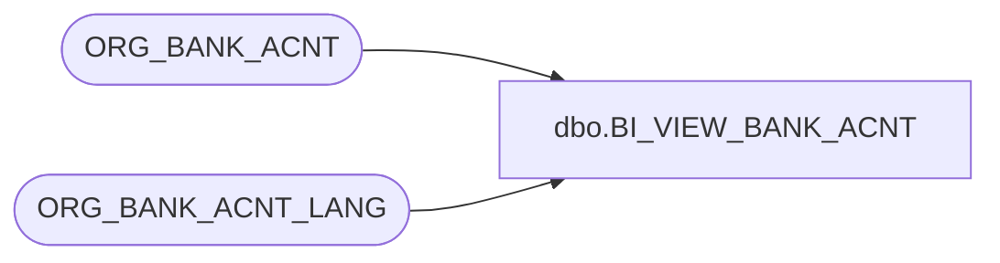

# dbo.BI_VIEW_BANK_ACNT

**Database:** auditworks  
**Server:** bedrockdb01  

## Architecture Diagram



## Table Dependencies

| Referenced Table |
|---|
| ORG_BANK_ACNT |
| ORG_BANK_ACNT_LANG |

## View Code

```sql
/* script 
   modified May31,2012 - recreate default on if_transaction_header.date_reject_id if it does not exist
   modified May10,2012 - recreate 3 missing default constraints on upgrade as per defect 135045
   modified May07,2012 - removed drop and recreate of scoping_salesaudit_x0 since it is now a pk
   modified Nov18,2011 - avoid creating default on obsolete column in interface_applicabilty_lookup
   modified Aug10,2011 - print warning re ignoring default already exists
   modified Aug09,2011 - added recreate for dependent BI view that had to be dropped
   modified March21,2011 by Paul S - comment out recreate of numeric pk because they did not need to be dropped
   modified Apr 28,2011 by Paul S  - recreate default on code_description.approval_date
*/


/* recreate for dependent BI view that had to be dropped */

create view dbo.BI_VIEW_BANK_ACNT as
SELECT o.BANK_ACNT_ID, o.BANK_ID, o.BANK_BRNCH_ID,BANK_ACNT_NUM, ISNULL(l.BANK_ACNT_DESC, o.BANK_ACNT_DESC) AS BANK_ACNT_DESC, GL_RFRNC_NUM,
 ACTV, ISNULL(l.LANG_ID, 1033) AS LANG_ID
 FROM ORG_BANK_ACNT o
 LEFT OUTER JOIN ORG_BANK_ACNT_LANG l ON o.BANK_ACNT_ID = l.BANK_ACNT_ID
```

