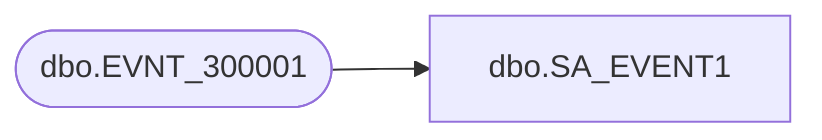

# dbo.SA_EVENT1

**Database:** auditworks  
**Server:** bedrockdb01  

## Architecture Diagram



## Table Dependencies

| Referenced Table |
|---|
| dbo.EVNT_300001 |

## View Code

```sql
create view dbo.SA_EVENT1 AS
SELECT EVNT_ID, 
       EVNT_TYPE_ID, 
       SRVR_NAME, 
       APP_ID, 
       PRDCT_ID, 
       INSTNC_NUM, 
       USER_ID, 
       EVNT_POST_DTM, 
       EVNT_CRTN_DTM, 
       STRG_MCHNSM, 
       FLD_715, 
       FLD_418, 
       FLD_419, 
       FLD_716, 
       FLD_421, 
       FLD_717 FROM foundation_event.dbo.EVNT_300001
```

