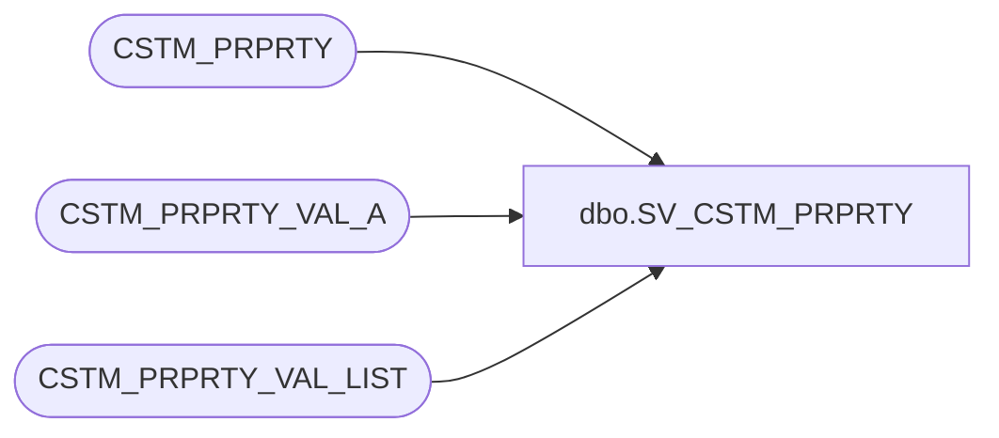

# dbo.SV_CSTM_PRPRTY

**Database:** auditworks  
**Server:** bedrockdb01  

## Architecture Diagram



## Table Dependencies

| Referenced Table |
|---|
| CSTM_PRPRTY |
| CSTM_PRPRTY_VAL_A |
| CSTM_PRPRTY_VAL_LIST |

## View Code

```sql
CREATE VIEW [dbo].[SV_CSTM_PRPRTY]
AS
SELECT CSTM_PRPRTY.CSTM_PRPRTY_CODE, CSTM_PRPRTY.CSTM_PRPRTY_TYPE, CSTM_PRPRTY_DESC, ASGND_ENTY_OBJCT_ID,
CASE DATA_TYPE WHEN 'A' THEN  DATA_VAL ELSE NULL END AS DATA_VAL_ALPHA,
CASE DATA_TYPE WHEN 'P' THEN  
		(SELECT CSTM_PRPRTY_VAL_DESC FROM CSTM_PRPRTY_VAL_LIST 
		WHERE CSTM_PRPRTY.CSTM_PRPRTY_TYPE = CSTM_PRPRTY_VAL_LIST.CSTM_PRPRTY_TYPE
		AND CSTM_PRPRTY.CSTM_PRPRTY_CODE = CSTM_PRPRTY_VAL_LIST.CSTM_PRPRTY_CODE
		AND CSTM_PRPRTY_VAL_LIST.CSTM_PRPRTY_VAL_CODE =  CSTM_PRPRTY_VAL_A.DATA_VAL) ELSE NULL END AS DATA_VAL_LIST,
CASE DATA_TYPE WHEN 'N' THEN CONVERT (decimal, DATA_VAL) ELSE NULL END AS DATA_VAL_NUM,
CASE DATA_TYPE WHEN 'D' THEN CONVERT (smalldatetime, DATA_VAL, 101) ELSE NULL END AS DATA_VAL_DATE
FROM CSTM_PRPRTY
INNER JOIN CSTM_PRPRTY_VAL_A 
ON CSTM_PRPRTY.CSTM_PRPRTY_CODE = CSTM_PRPRTY_VAL_A.CSTM_PRPRTY_CODE
AND CSTM_PRPRTY.CSTM_PRPRTY_TYPE = CSTM_PRPRTY_VAL_A.CSTM_PRPRTY_TYPE
```

