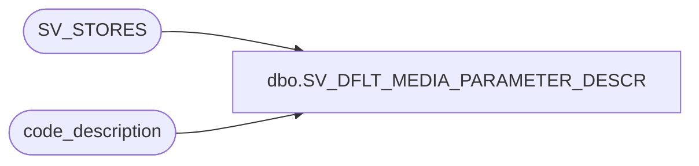

# dbo.SV_DFLT_MEDIA_PARAMETER_DESCR

**Database:** auditworks  
**Server:** bedrockdb01  

## Architecture Diagram



## Table Dependencies

| Referenced Table |
|---|
| SV_STORES |
| code_description |

## View Code

```sql
create view dbo.SV_DFLT_MEDIA_PARAMETER_DESCR                                             
AS
SELECT o.ORG_CHN_NUM, o.MD_PRMTR_TBL_NUM, c.code_display_descr as dflt_media_parameter_set_descr 
FROM SV_STORES o
LEFT JOIN code_description c ON (c.code_type = 18 AND o.MD_PRMTR_TBL_NUM = c.code)
```

