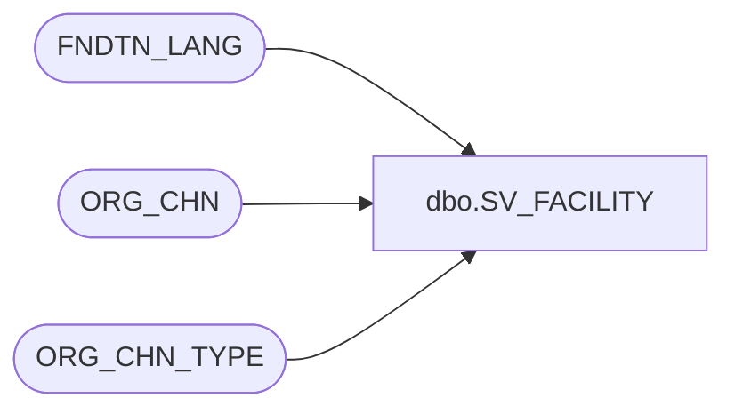

# dbo.SV_FACILITY

**Database:** auditworks  
**Server:** bedrockdb01  

## Architecture Diagram



## Table Dependencies

| Referenced Table |
|---|
| FNDTN_LANG |
| ORG_CHN |
| ORG_CHN_TYPE |

## View Code

```sql
create view [dbo].[SV_FACILITY] 
AS
SELECT o.ORG_CHN_NUM ,
       o.ORG_CHN_NAME,
       o.ORG_CHN_SHRT_NAME ,
       o.ORG_CHN_TYPE_CODE,
       o.PRTY_ID,
       ISNULL(f.LANG_DESC, CONVERT(VARCHAR,o.PRMRY_LANG_ID)) AS PRMRY_LANG,
       o.PRMRY_LANG_ID,
       o.AUTO_ACPT,
       o.GMT_OFST,
       o.GL_CMPNY_NUM,
       o.GL_LOC_NUM,
       o.USE_AS_TMPLT,
       o.TMPLT_DESC,
       o.OPEN_DATE,
       o.CLS_DATE,
       o.ACTV,
       o.STLMNT_BLNG_NAME,
       o.MD_PRMTR_TBL_NUM,
       o.VCHR_CNFG_TYPE,
       o.TAX_JRSDCTN_CODE,
       o.PRMRY_BANK_ACNT_ID,
       t.SYS_CODE,
       t.ORG_CHN_TYPE_SHRT_DESC,
       o.DFLT_CRNCY_CODE, 
       t.ORG_CHN_TYPE_DESC, 
       o.OPEN_TO_RCV_DATE, 
       o.OCPNCY_COST_FXD, 
       o.SHRNKG_FCTR, 
       o.RPLNSHBL, 
       o.OPEN_HOUR_ID, 
       o.SLNG_FLAG, 
       o.ORG_CHN_STS, 
       o.REOPEN_DATE, 
       o.WH_SYSTM, 
       o.ALLW_CSTM_ODR, 
       o.SND_INV_MVMNT_TO_OMS, 
       o.ALLW_CSTM_PKP_ODR, 
       o.SLNG_SPC, 
       o.NON_SLNG_SPC, 
       o.TRGT_SALES, 
       o.RTNG_PRRTY, 
       o.CLS_RSN, 
       o.COMP_DATE   
FROM ORG_CHN o
     INNER JOIN ORG_CHN_TYPE t ON (o.ORG_CHN_TYPE_CODE = t.ORG_CHN_TYPE_CODE)
     LEFT JOIN FNDTN_LANG f ON (o.PRMRY_LANG_ID = f.LANG_ID)
WHERE (o.LOC_CTGRY_CODE = 'FCLY')
```

