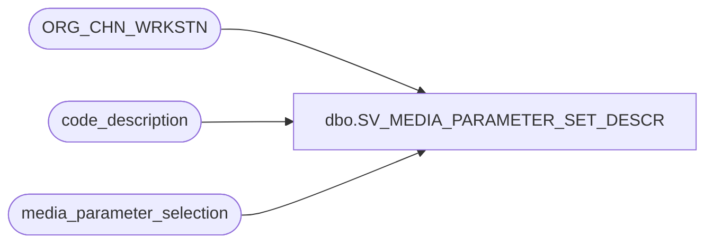

# dbo.SV_MEDIA_PARAMETER_SET_DESCR

**Database:** auditworks  
**Server:** bedrockdb01  

## Architecture Diagram



## Table Dependencies

| Referenced Table |
|---|
| ORG_CHN_WRKSTN |
| code_description |
| media_parameter_selection |

## View Code

```sql
create view dbo.SV_MEDIA_PARAMETER_SET_DESCR 
AS

SELECT w.ORG_CHN_NUM, w.WRKSTN_NUM, m.media_parameter_set_no, m.effective_from_date, m.effective_until_date,
c.code_display_descr as media_parameter_set_descr 
FROM ORG_CHN_WRKSTN w
LEFT OUTER JOIN media_parameter_selection m
ON w.ORG_CHN_NUM = m.store_no
and w.WRKSTN_NUM = m.register_no
LEFT OUTER JOIN code_description c
on c.code_type = 18
AND m.media_parameter_set_no   = c.code
```

