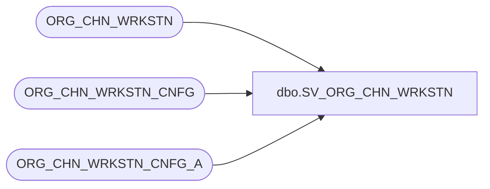

# dbo.SV_ORG_CHN_WRKSTN

**Database:** auditworks  
**Server:** bedrockdb01  

## Architecture Diagram



## Table Dependencies

| Referenced Table |
|---|
| ORG_CHN_WRKSTN |
| ORG_CHN_WRKSTN_CNFG |
| ORG_CHN_WRKSTN_CNFG_A |

## View Code

```sql
CREATE VIEW [dbo].[SV_ORG_CHN_WRKSTN] AS
SELECT ORG_CHN_NUM, WRKSTN_NUM, LOC_ID,  
EFCTV_DATE, EXPRTN_DATE,ORG_CHN_WRKSTN_CNFG_A.WRKSTN_CNFG_CODE, 
 WRKSTN_CNFG_DESC, WRKSTN_CNFG_SHRT_DESC
FROM ORG_CHN_WRKSTN
LEFT JOIN ORG_CHN_WRKSTN_CNFG_A
ON ORG_CHN_WRKSTN.WRKSTN_ID = ORG_CHN_WRKSTN_CNFG_A.WRKSTN_ID
LEFT JOIN ORG_CHN_WRKSTN_CNFG
ON ORG_CHN_WRKSTN_CNFG_A.WRKSTN_CNFG_CODE = ORG_CHN_WRKSTN_CNFG.WRKSTN_CNFG_CODE
```

