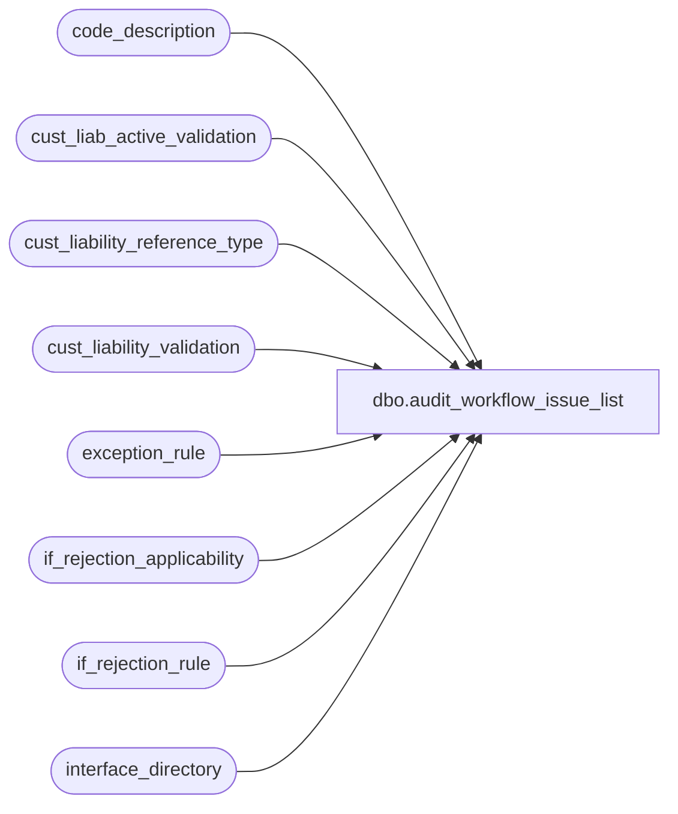

# dbo.audit_workflow_issue_list

**Database:** auditworks  
**Server:** bedrockdb01  

## Architecture Diagram



## Table Dependencies

| Referenced Table |
|---|
| code_description |
| cust_liab_active_validation |
| cust_liability_reference_type |
| cust_liability_validation |
| exception_rule |
| if_rejection_applicability |
| if_rejection_rule |
| interface_directory |

## View Code

```sql
CREATE VIEW dbo.audit_workflow_issue_list 
AS
SELECT t.code workflow_issue_type, i.code workflow_issue_code, '0' workflow_issue_code_qualifier, t.code_display_descr workflow_issue_type_descr, i.code_display_descr workflow_issue_descr, i.active_flag, i.resource_id, t.resource_id type_resource_id 
  FROM code_description t
       INNER JOIN code_description i
          ON i.code_type = 31  --Had considered doing 215...
 WHERE t.code_type = 93
   AND t.code = 1
UNION
SELECT t.code workflow_issue_type, i.code workflow_issue_code, '0' workflow_issue_code_qualifier, t.code_display_descr workflow_issue_type_descr, i.code_display_descr workflow_issue_descr, i.active_flag, i.resource_id, t.resource_id type_resource_id 
  FROM code_description t
       INNER JOIN code_description i
          ON i.code_type = 31
 WHERE t.code_type = 93
   AND t.code = 2

UNION
SELECT t.code workflow_issue_type, i.code workflow_issue_code, '0' workflow_issue_code_qualifier, t.code_display_descr workflow_issue_type_descr, i.code_display_descr workflow_issue_descr, i.active_flag, i.resource_id, t.resource_id type_resource_id
  FROM code_description t
       INNER JOIN code_description i
          ON i.code_type = 30
         AND i.code > 0
 WHERE t.code_type = 93
   AND t.code = 3
UNION
SELECT t.code workflow_issue_type, i.code workflow_issue_code, '0' workflow_issue_code_qualifier, t.code_display_descr workflow_issue_type_descr, i.code_display_descr workflow_issue_descr, i.active_flag, i.resource_id, t.resource_id type_resource_id 
  FROM code_description t
       INNER JOIN code_description i
          ON i.code_type = 13
         AND i.code = 5
 WHERE t.code_type = 93
   AND t.code = 4
UNION
SELECT t.code workflow_issue_type, i.code workflow_issue_code, '0' workflow_issue_code_qualifier, t.code_display_descr workflow_issue_type_descr, i.code_display_descr workflow_issue_descr, i.active_flag, i.resource_id, t.resource_id type_resource_id 
  FROM code_description t
       INNER JOIN code_description i
          ON i.code_type = 9
 WHERE t.code_type = 93
   AND t.code = 5
UNION
SELECT t.code workflow_issue_type, i.if_rejection_reason workflow_issue_code, CONVERT(VARCHAR, COALESCE(v.validation_id, 0)) workflow_issue_code_qualifier, t.code_display_descr workflow_issue_type_descr, i.if_rejection_description + CASE WHEN v.reject_reason_description IS NULL THEN '' ELSE ' -' + v.reject_reason_description END workflow_issue_descr, CASE WHEN COALESCE(a.active_flag, 0) = 0 OR v.active_flag = 0 THEN 0 ELSE 1 END active_flag, COALESCE(v.reason_resource_id, i.resource_id) resource_id, t.resource_id type_resource_id
  FROM code_description t
       INNER JOIN if_rejection_rule i
          ON COALESCE(i.active_rejection_rule, 1) = 1
        LEFT OUTER JOIN (SELECT DISTINCT a.if_reject_reason, 1 active_flag
                           FROM if_rejection_applicability a
                                INNER JOIN interface_directory d
                                   ON a.interface_id = d.interface_id
                                  AND d.update_timing > 0) a
          ON i.if_rejection_reason = a.if_reject_reason
        LEFT OUTER JOIN (SELECT DISTINCT v.validation_id, v.reject_reason_description, v.reason_resource_id, 
                                         CASE WHEN a.validation_id IS NULL THEN 0 ELSE 1 END active_flag
                           FROM cust_liability_validation v
                                LEFT OUTER JOIN cust_liab_active_validation a
                                   ON a.validation_id = v.validation_id) v
          ON i.if_rejection_reason = 100
 WHERE t.code_type = 93
   AND t.code = 6
UNION   
SELECT t.code workflow_issue_type, i.code workflow_issue_code, '0' workflow_issue_code_qualifier, t.code_display_descr workflow_issue_type_descr, i.code_display_descr workflow_issue_descr, i.active_flag, i.resource_id, t.resource_id type_resource_id 
  FROM code_description t
       INNER JOIN code_description i
          ON i.code_type = 209
 WHERE t.code_type = 93
   AND t.code = 7
UNION
SELECT t.code workflow_issue_type, i.code workflow_issue_code, '0' workflow_issue_code_qualifier, t.code_display_descr workflow_issue_type_descr, i.code_display_descr workflow_issue_descr, c.reference_type_active_flag active_flag, i.resource_id, t.resource_id type_resource_id 
  FROM code_description t
       INNER JOIN cust_liability_reference_type c 
          ON c.pos_lookup = 1
       INNER JOIN code_description i
          ON i.code_type = 22
         AND i.code = c.reference_type
 WHERE t.code_type = 93
   AND t.code = 8   
UNION
SELECT t.code workflow_issue_type,  0 workflow_issue_code, '0' workflow_issue_code_qualifier, t.code_display_descr workflow_issue_type_descr, t.code_display_descr workflow_issue_descr, t.active_flag, t.resource_id, t.resource_id type_resource_id  
  FROM code_description t
 WHERE t.code_type = 93
   AND t.code in (9, 11, 13, 14)
UNION
SELECT t.code workflow_issue_type,  i.code workflow_issue_code, '0' workflow_issue_code_qualifier, t.code_display_descr workflow_issue_type_descr, i.code_display_descr workflow_issue_descr, i.active_flag, i.resource_id, t.resource_id type_resource_id  
  FROM code_description t
       INNER JOIN code_description i
          ON i.code_type = 86
         AND i.code in (2, 4)
 WHERE t.code_type = 93
   AND t.code  = 10
UNION
SELECT t.code workflow_issue_type, i.exception_rule workflow_issue_code, convert(varchar, i.exception_type) workflow_issue_code_qualifier, t.code_display_descr workflow_issue_type_descr, q.code_display_descr + ' -' + i.exception_name workflow_issue_descr, CASE WHEN ACTV = 0 OR exception_type = 0 THEN 0 ELSE 1 END active_flag, CONVERT(numeric(12,0), NULL) resource_id, t.resource_id type_resource_id   
  FROM code_description t
       INNER JOIN exception_rule i
          ON exception_rule >= 0
       INNER JOIN code_description q
          ON q.code_type = 60
         AND i.exception_type = q.code
 WHERE t.code_type = 93
   AND t.code = 12   
UNION
SELECT t.code workflow_issue_type, i.code workflow_issue_code, '0' workflow_issue_code_qualifier, t.code_display_descr workflow_issue_type_descr, i.code_display_descr workflow_issue_descr, i.active_flag, i.resource_id, t.resource_id type_resource_id 
  FROM code_description t
       INNER JOIN code_description i
          ON i.code_type = 13
         AND i.code in (50, 100, 200, 300, 400, 500)  --note, subsequent retrieval in CR will merge some other statuses into these and the trickle/in-progress will override the status
 WHERE t.code_type = 93
   AND t.code = 20
```

