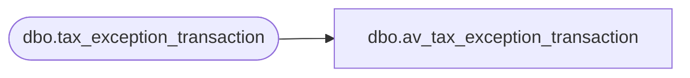

# dbo.av_tax_exception_transaction

**Database:** auditworks  
**Server:** bedrockdb01  

## Architecture Diagram



## Table Dependencies

| Referenced Table |
|---|
| dbo.tax_exception_transaction |

## View Code

```sql
CREATE view  dbo.av_tax_exception_transaction AS 
SELECT * /* dummy version of view */
  FROM dbo.tax_exception_transaction
```

