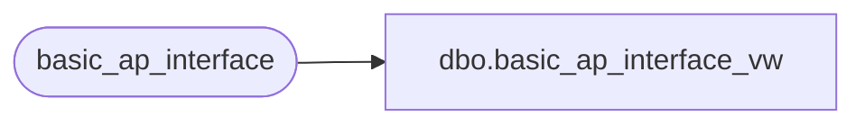

# dbo.basic_ap_interface_vw

**Database:** auditworks  
**Server:** bedrockdb01  

## Architecture Diagram



## Table Dependencies

| Referenced Table |
|---|
| basic_ap_interface |

## View Code

```sql
create view dbo.basic_ap_interface_vw  AS
SELECT
company_no,
bank_code,
filler_1,
invoice_no,
invoice_type,
hold_flag,
invoice_remark,
gross_invoice_amount,
discount_amount,
entered_date,
invoice_date,
due_date,
discount_date,
first_expense_account,
gl_expense_accounts,
first_distribution_amount,
gl_distribution_amount1,
gl_distribution_amount2,
gl_distribution_amount3,
gl_distribution_amount4,
gl_distribution_amount5,
gl_distribution_amount6,
gl_distribution_amount7,
gl_distribution_amount8,
gl_distribution_amount9,
vendor_name,
address_1,
address_2,
telephone_no,
filler_2
FROM basic_ap_interface
```

