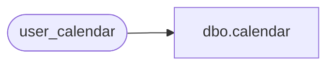

# dbo.calendar

**Database:** auditworks  
**Server:** bedrockdb01  

## Architecture Diagram



## Table Dependencies

| Referenced Table |
|---|
| user_calendar |

## View Code

```sql
CREATE  view dbo.calendar 
AS
SELECT  calendar_date,
	merchandise_week_no,
	merchandise_month_no,
	merchandise_year_no,
	merchandise_season_no,
	week_end_flag,
	month_end_flag,
	year_end_flag,
	timestamp
FROM user_calendar
```

