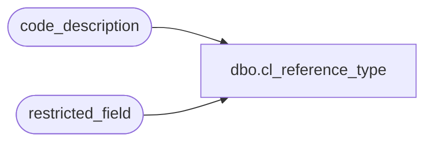

# dbo.cl_reference_type

**Database:** auditworks  
**Server:** bedrockdb01  

## Architecture Diagram



## Table Dependencies

| Referenced Table |
|---|
| code_description |
| restricted_field |

## View Code

```sql
create view dbo.cl_reference_type 
as 
SELECT *
  FROM code_description 
 WHERE code_type = 22 
   AND code <= 255     
   AND active_flag = 1
   AND (   (code > 0 AND code < 9) 
        OR (code >= 201 AND code <= 204) 
        OR code IN (220, 221, 228) 
        OR code IN (230, 231, 232, 233, 234, 235)  --reserved for future use by OMS
        OR code_meaning_control = 'U') 
   AND code NOT IN (SELECT field_value
                      FROM restricted_field
                     WHERE field_name = 'reference_type' 
                       AND restriction_level = 1 
                       AND active_flag = 1)
```

