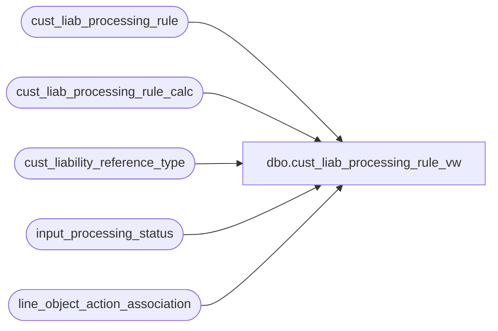

# dbo.cust_liab_processing_rule_vw

**Database:** auditworks  
**Server:** bedrockdb01  

## Architecture Diagram



## Table Dependencies

| Referenced Table |
|---|
| cust_liab_processing_rule |
| cust_liab_processing_rule_calc |
| cust_liability_reference_type |
| input_processing_status |
| line_object_action_association |

## View Code

```sql
create view dbo.cust_liab_processing_rule_vw  as
SELECT r.reference_type, r.rule_id, r.rule_id_description, last_processing_date, outstanding_request_datetime, 
       r.processing_activation_type, 
       r.transaction_category, 
       CASE WHEN x.reference_type <> 0 
            THEN 0 
            ELSE CASE WHEN (  (r.balance_adjustment_type = 9 AND EXISTS (SELECT 1 
                                                       FROM cust_liab_processing_rule_calc c 
                                                      WHERE c.rule_id = r.rule_id 
                                                        AND c.adjustment_line_type = 'CONDITION'))
                            OR r.age_selection_criteria > 0
                            OR r.inactivity_selection_criteria > 0 )
                            AND r.transaction_category IN (241, 246, 248, 249)
                      THEN 1
                      ELSE 0 
                      END 
            END unattended_flag,
       CASE WHEN COALESCE(r.processing_activation_type, -1) = 0 THEN 1 ELSE 0 END automated_flag,
       Row_Number() OVER ( ORDER BY r.reference_type, 
       			         CASE WHEN r.transaction_category <> 241 THEN 1000 + r.transaction_category ELSE 1247.5 END, 
       			         r.rule_id) display_sequence_no  
  FROM cust_liab_processing_rule r
       INNER JOIN cust_liability_reference_type c
          ON r.reference_type = c.reference_type
         AND c.reference_type_active_flag = 1
        LEFT OUTER JOIN line_object_action_association x
          ON r.transaction_category = x.transaction_category
         AND r.line_object_offset = x.line_object
         AND r.line_action_offset = x.line_action
	LEFT OUTER JOIN (SELECT p.processing_message rule_id, MAX(p.process_start_datetime) outstanding_request_datetime
		           FROM input_processing_status p
		          WHERE p.processing_message IS NOT NULL 
		            AND p.process_no IN (241, 243, 246, 247, 248, 249) 
			  GROUP BY p.processing_message) os
          ON os.rule_id = r.rule_id
 WHERE r.rule_active_flag = 1 
   AND COALESCE(r.processing_activation_type, -2) <> -1
   AND r.transaction_category <> 242
```

