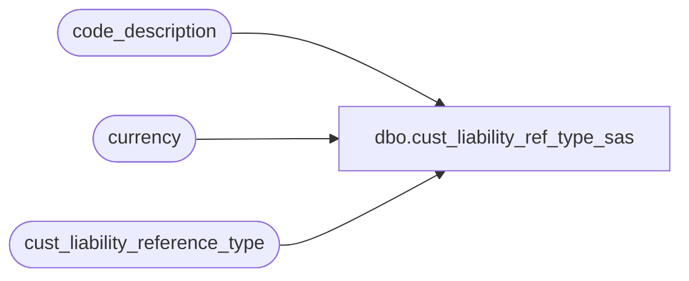

# dbo.cust_liability_ref_type_sas

**Database:** auditworks  
**Server:** bedrockdb01  

## Architecture Diagram



## Table Dependencies

| Referenced Table |
|---|
| code_description |
| currency |
| cust_liability_reference_type |

## View Code

```sql
create view dbo.cust_liability_ref_type_sas  as
SELECT cl.reference_type, cl.reference_no_length, cl.unique_by_store_key, cl.currency_id, c.currency_code, cd.code_display_descr reference_type_description, substring(cd.alpha_code, 4, 8) pos_tender_idx, c.currency_symbol 
  FROM cust_liability_reference_type cl 
       LEFT OUTER JOIN currency c
         ON cl.currency_id = c.currency_id
       LEFT OUTER JOIN code_description cd
         ON cd.code_type = 22
        AND cl.reference_type = cd.code
 WHERE cl.pos_lookup > 0 
   AND cl.reference_type_active_flag > 0
```

