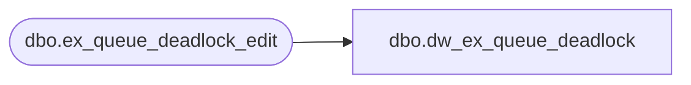

# dbo.dw_ex_queue_deadlock

**Database:** auditworks  
**Server:** bedrockdb01  

## Architecture Diagram



## Table Dependencies

| Referenced Table |
|---|
| dbo.ex_queue_deadlock_edit |

## View Code

```sql
create view dbo.dw_ex_queue_deadlock as
SELECT * FROM dbo.ex_queue_deadlock_edit
```

