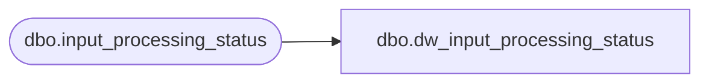

# dbo.dw_input_processing_status

**Database:** auditworks  
**Server:** bedrockdb01  

## Architecture Diagram



## Table Dependencies

| Referenced Table |
|---|
| dbo.input_processing_status |

## View Code

```sql
CREATE VIEW dbo.dw_input_processing_status AS
SELECT input_id,
       process_start_datetime,
       process_no,
       processing_message,
       status,
       instance_id,
       to_instance_id,
       request_date,
       request_id
  FROM dbo.input_processing_status
```

