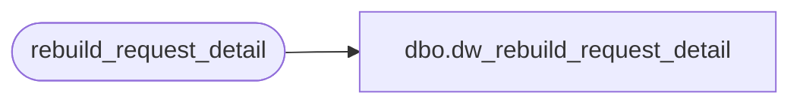

# dbo.dw_rebuild_request_detail

**Database:** auditworks  
**Server:** bedrockdb01  

## Architecture Diagram



## Table Dependencies

| Referenced Table |
|---|
| rebuild_request_detail |

## View Code

```sql
CREATE VIEW dbo.dw_rebuild_request_detail AS
SELECT request_id,
       rebuild_type,
       store_no,
       transaction_date,
       request_status,
       process_id,
       copied_from_request_id,
       date_reject_id,
       register_no
  FROM rebuild_request_detail
```

