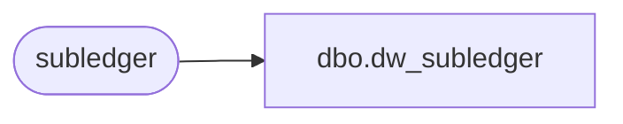

# dbo.dw_subledger

**Database:** auditworks  
**Server:** bedrockdb01  

## Architecture Diagram



## Table Dependencies

| Referenced Table |
|---|
| subledger |

## View Code

```sql
CREATE VIEW dbo.dw_subledger AS
SELECT fiscal_year,
       period,
       gl_company,
       gl_account_id,
       store_no,
       transaction_date,
       transaction_category,
       line_object,
       line_action,
       amount,
       units,
       transaction_qty,
       store_balance_group,
       posting_status,
       register_no,
       posting_datetime,
       data_source,
       gl_posting_datetime,
       last_modified_date_time
  FROM subledger
```

