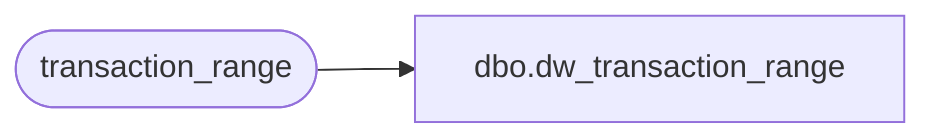

# dbo.dw_transaction_range

**Database:** auditworks  
**Server:** bedrockdb01  

## Architecture Diagram



## Table Dependencies

| Referenced Table |
|---|
| transaction_range |

## View Code

```sql
create view dbo.dw_transaction_range 
AS 
SELECT *
FROM transaction_range
```

