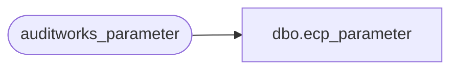

# dbo.ecp_parameter

**Database:** auditworks  
**Server:** bedrockdb01  

## Architecture Diagram



## Table Dependencies

| Referenced Table |
|---|
| auditworks_parameter |

## View Code

```sql
create view dbo.ecp_parameter 
as
  SELECT *
  FROM auditworks_parameter
  where par_group_code like 'ECP%'
```

