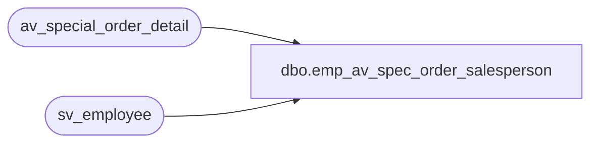

# dbo.emp_av_spec_order_salesperson

**Database:** auditworks  
**Server:** bedrockdb01  

## Architecture Diagram



## Table Dependencies

| Referenced Table |
|---|
| av_special_order_detail |
| sv_employee |

## View Code

```sql
create view dbo.emp_av_spec_order_salesperson as 
select distinct s.salesperson as employee_no,
    e.employee_first_name, e.employee_last_name, e.home_store_no,
    e.employee_type, e.verified,e.house_account_no,
    e.date_of_hire, e.date_of_termination,
    e.employee_department, e.employee_type_descr,
    e.timestamp
from av_special_order_detail s
left outer join sv_employee e
on s.salesperson = e.employee_no
```

