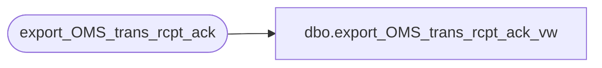

# dbo.export_OMS_trans_rcpt_ack_vw

**Database:** auditworks  
**Server:** bedrockdb01  

## Architecture Diagram



## Table Dependencies

| Referenced Table |
|---|
| export_OMS_trans_rcpt_ack |

## View Code

```sql
CREATE VIEW [dbo].[export_OMS_trans_rcpt_ack_vw]
    AS SELECT '{"Transactions": [' delimited_field_col1 WHERE EXISTS (SELECT 1 FROM export_OMS_trans_rcpt_ack)
       UNION ALL
       SELECT delimited_field_col1 + CASE WHEN  entry_id = (select MAX(entry_id) from export_OMS_trans_rcpt_ack ) THEN ' ' else ',' END FROM export_OMS_trans_rcpt_ack
       UNION ALL
       SELECT '] }' delimited_field_col1 WHERE EXISTS (SELECT 1 FROM export_OMS_trans_rcpt_ack)
```

