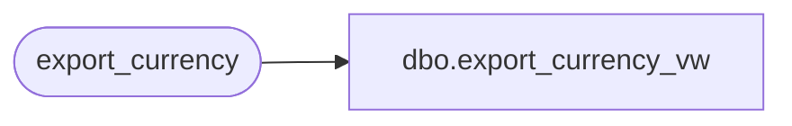

# dbo.export_currency_vw

**Database:** auditworks  
**Server:** bedrockdb01  

## Architecture Diagram



## Table Dependencies

| Referenced Table |
|---|
| export_currency |

## View Code

```sql
create view dbo.export_currency_vw 
AS SELECT currency_id, currency_code, currency_description, active_flag,
          resource_id, display_mask
FROM export_currency
```

