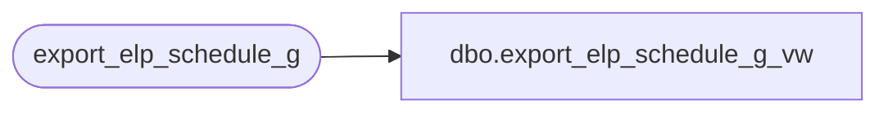

# dbo.export_elp_schedule_g_vw

**Database:** auditworks  
**Server:** bedrockdb01  

## Architecture Diagram



## Table Dependencies

| Referenced Table |
|---|
| export_elp_schedule_g |

## View Code

```sql
create view export_elp_schedule_g_vw
as SELECT yyyymmdd, company_no, division_code, region_code, structure_code,
          store_no, register_no, cashier_no, balancing_method, sales_date,
          media_short_ch, media_short_sign, basic_sa_prefix
FROM export_elp_schedule_g
```

