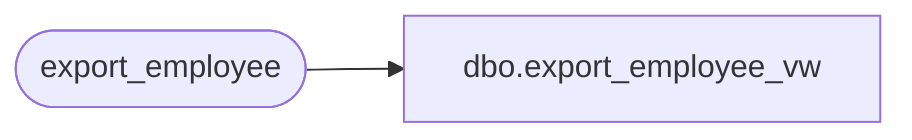

# dbo.export_employee_vw

**Database:** auditworks  
**Server:** bedrockdb01  

## Architecture Diagram



## Table Dependencies

| Referenced Table |
|---|
| export_employee |

## View Code

```sql
create view dbo.export_employee_vw 
AS SELECT employee_no, employee_first_name, employee_last_name, home_store_no,
          employee_type, verified, house_account_no, date_of_hire, date_of_termination,
          employee_department
FROM export_employee
```

