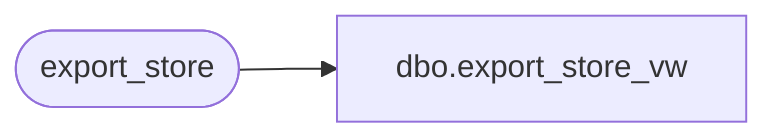

# dbo.export_store_vw

**Database:** auditworks  
**Server:** bedrockdb01  

## Architecture Diagram



## Table Dependencies

| Referenced Table |
|---|
| export_store |

## View Code

```sql
create view dbo.export_store_vw 
AS SELECT store_no, tax_jurisdiction, tax_strip_table_no, media_parameter_table_no,
          balancing_method, deposit_balancing_method, petty_cash_line_object,
          multiple_mediacounts_added, autoaccept_flag, tax_strip_flag, outlet_store_flag,
          settlement_billing_name, store_deposit_destination, interstore_export_region,
          gl_company, gl_store, country_id, timezone_offset_hours, city, state_code,
          zip_code, comp_date, store_export_code, open_date, log_tax_override, currency_id
FROM export_store
```

