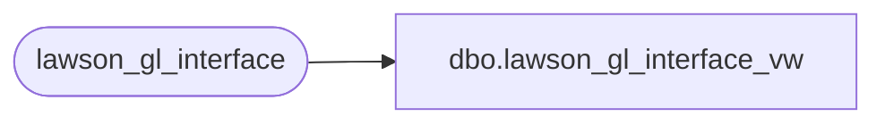

# dbo.lawson_gl_interface_vw

**Database:** auditworks  
**Server:** bedrockdb01  

## Architecture Diagram



## Table Dependencies

| Referenced Table |
|---|
| lawson_gl_interface |

## View Code

```sql
create view dbo.lawson_gl_interface_vw  AS
SELECT run_group, seq_number, company, old_company, old_acct_no, source_code,
  calendar_date, refer, description, currency, units_amt, trans_amt, base_amt, baserate,
  system, program_code, autorev, posting_date, activity, acct_catg, doc_nbr, to_base_amt,
  effect_date, jnl_book_nbr, mx1, mx2, mx3
FROM lawson_gl_interface
```

