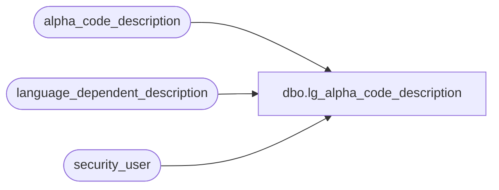

# dbo.lg_alpha_code_description

**Database:** auditworks  
**Server:** bedrockdb01  

## Architecture Diagram



## Table Dependencies

| Referenced Table |
|---|
| alpha_code_description |
| language_dependent_description |
| security_user |

## View Code

```sql
create view dbo.lg_alpha_code_description 
as
SELECT code_type
,code
,code_status
,IsNull(ld.display_description, code_display_descr1) as code_display_descr1
,code_display_descr2
,system_code
,s.resource_id
,s.active_flag
FROM alpha_code_description s
     INNER JOIN security_user u
        ON u.user_id = suser_sname()
      LEFT OUTER JOIN language_dependent_description ld 
        ON s.resource_id = ld.resource_id
       AND u.language_id = ld.language_id
```

