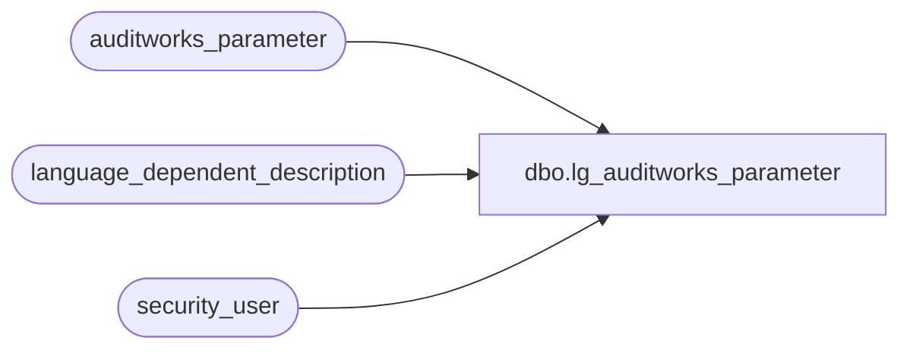

# dbo.lg_auditworks_parameter

**Database:** auditworks  
**Server:** bedrockdb01  

## Architecture Diagram



## Table Dependencies

| Referenced Table |
|---|
| auditworks_parameter |
| language_dependent_description |
| security_user |

## View Code

```sql
create view dbo.lg_auditworks_parameter  
as
SELECT par_name
,par_value
,par_type
,par_value_from_range
,par_value_to_range
,IsNull(c1.display_description, par_comment) as par_comment
,code_type
,IsNull(ld.display_description, par_name_display_descr) as par_name_display_descr
,s.resource_id
,s.comment_resource_id
,s.min_compatible_exe
,s.par_bin_value
,s.par_group_code
,s.drop_down_query
,s.par_nullable_flag
,s.warning_code
,s.par_node_id
,s.active_flag
FROM auditworks_parameter s
     INNER JOIN security_user u
        ON u.user_id = suser_sname()
      LEFT OUTER JOIN language_dependent_description ld 
        ON s.resource_id = ld.resource_id
       AND u.language_id = ld.language_id
      LEFT OUTER JOIN language_dependent_description c1 
        ON s.comment_resource_id = c1.resource_id
       AND u.language_id = c1.language_id
WHERE (u.current_exe IS NULL OR s.min_compatible_exe IS NULL OR u.current_exe >= s.min_compatible_exe)

dbo,employee_comms_auto_adj_a_c_vw,--Assignment Definition grid-style retrieval
CREATE VIEW employee_comms_auto_adj_a_c_vw
AS
SELECT a.auto_commission_adj_id, a.auto_adjustment_description, 
       t.assignment_type,
       CASE WHEN t.assignment_type = '50_home_store' THEN NULL ELSE COUNT(aa.auto_commission_adj_id) END assignment_cnt
  FROM employee_comms_auto_adj a
       INNER JOIN (SELECT '10_employee_no' assignment_type UNION SELECT '20_employee_commission_code'UNION SELECT '30_primary_selling_area_no' UNION SELECT '40_primary_position' UNION SELECT '50_home_store' UNION SELECT '60_home_store_no' UNION SELECT '70_home_store_commission_code') t
         ON 1=1
       LEFT OUTER JOIN employee_comms_auto_adj_assign aa
          ON a.auto_commission_adj_id = aa.auto_commission_adj_id
         AND CASE WHEN employee_no <> -1
            THEN '10_employee_no'
            ELSE CASE WHEN employee_commission_code <> '-1' 
                      THEN '20_employee_commission_code'
                      ELSE CASE WHEN primary_selling_area_no <> -1
                                THEN '30_primary_selling_area_no'
                                ELSE CASE WHEN primary_position <> '-1'
                                          THEN '40_primary_position'
                                          ELSE CASE WHEN home_store_no <> -1
                                                    THEN '60_home_store_no'
                                                    ELSE CASE WHEN home_store_commission_code <> '-1'
                                                             THEN '70_home_store_commission_code'
                                                              ELSE '20_employee_commission_code'
                                                         END
                                               END
                                     END
                           END
                  END
       END = t.assignment_type
GROUP BY a.auto_commission_adj_id, a.auto_adjustment_description, t.assignment_type
--ORDER BY a.auto_commission_adj_id, t.assignment_type
```

