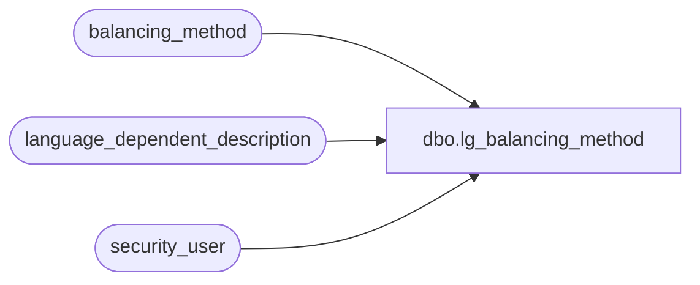

# dbo.lg_balancing_method

**Database:** auditworks  
**Server:** bedrockdb01  

## Architecture Diagram



## Table Dependencies

| Referenced Table |
|---|
| balancing_method |
| language_dependent_description |
| security_user |

## View Code

```sql
create view dbo.lg_balancing_method    
as 
SELECT s.balancing_method,
IsNull(ld.display_description, s.balancing_method_description) as balancing_method_description,
s.active_flag,
s.store_no_factor,
s.register_no_factor,
s.till_no_factor,
s.cashier_no_factor,
s.bank_no_factor,
s.resource_id
FROM balancing_method s
     INNER JOIN security_user u
        ON u.user_id = suser_sname()
      LEFT OUTER JOIN language_dependent_description ld 
        ON s.resource_id = ld.resource_id
       AND u.language_id = ld.language_id
```

