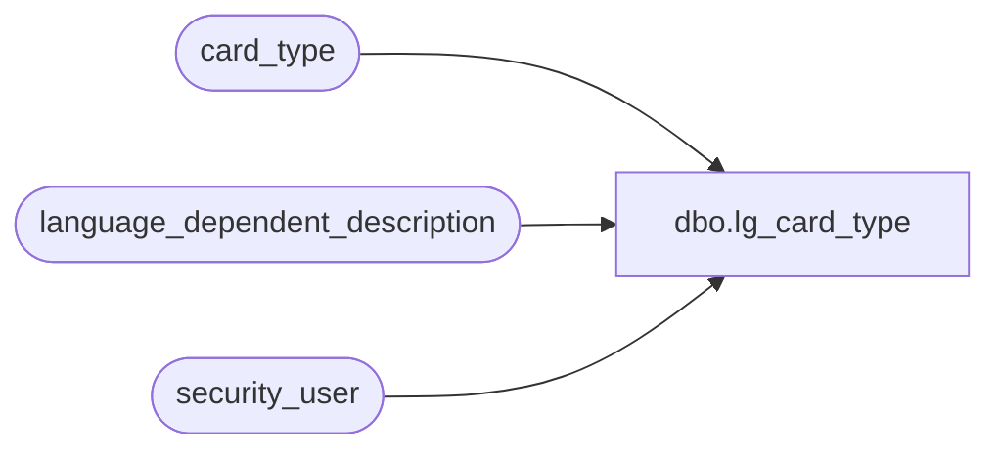

# dbo.lg_card_type

**Database:** auditworks  
**Server:** bedrockdb01  

## Architecture Diagram



## Table Dependencies

| Referenced Table |
|---|
| card_type |
| language_dependent_description |
| security_user |

## View Code

```sql
create view dbo.lg_card_type 
as
SELECT card_type
,line_object
,IsNull(ld.display_description, card_type_description) as card_type_description
,check_digit_routine_number
,payment_line_object
,gl_replacement_value
,s.resource_id
FROM card_type s
     INNER JOIN security_user u
        ON u.user_id = suser_sname()
      LEFT OUTER JOIN language_dependent_description ld 
        ON s.resource_id = ld.resource_id
       AND u.language_id = ld.language_id
```

