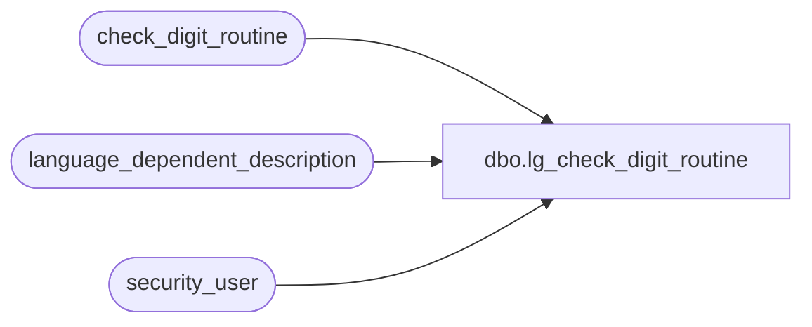

# dbo.lg_check_digit_routine

**Database:** auditworks  
**Server:** bedrockdb01  

## Architecture Diagram



## Table Dependencies

| Referenced Table |
|---|
| check_digit_routine |
| language_dependent_description |
| security_user |

## View Code

```sql
create view dbo.lg_check_digit_routine 
as

SELECT check_digit_routine_no
,multiplier1
,multiplier2
,multiplier3
,multiplier4
,multiplier5
,multiplier6
,multiplier7
,multiplier8
,multiplier9
,multiplier10
,multiplier11
,multiplier12
,multiplier13
,multiplier14
,multiplier15
,multiplier16
,multiplier17
,multiplier18
,multiplier19
,multiplier20
,sum_of_product_digits
,sum_of_products
,complement
,divisor
,IsNull(ld.display_description, check_digit_descr) as check_digit_descr
,s.resource_id
FROM check_digit_routine s
     INNER JOIN security_user u
        ON u.user_id = suser_sname()
      LEFT OUTER JOIN language_dependent_description ld 
        ON s.resource_id = ld.resource_id
       AND u.language_id = ld.language_id
```

