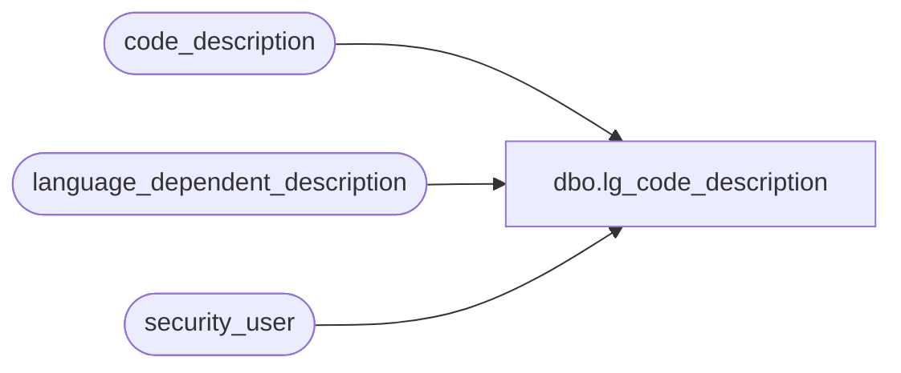

# dbo.lg_code_description

**Database:** auditworks  
**Server:** bedrockdb01  

## Architecture Diagram



## Table Dependencies

| Referenced Table |
|---|
| code_description |
| language_dependent_description |
| security_user |

## View Code

```sql
create view dbo.lg_code_description  
as

SELECT s.code_type
,s.code
,IsNull(ld.display_description, code_display_descr) as code_display_descr
,s.code_meaning_control
,s.code_system_descr
,s.resource_id
,s.min_compatible_exe
,s.alpha_code 
,s.active_flag
FROM code_description s
     INNER JOIN security_user u
        ON u.user_id = suser_sname()
      LEFT OUTER JOIN language_dependent_description ld 
        ON s.resource_id = ld.resource_id
       AND u.language_id = ld.language_id
WHERE s.active_flag > 0
AND (u.current_exe is null OR s.min_compatible_exe is null OR u.current_exe >= s.min_compatible_exe)
```

